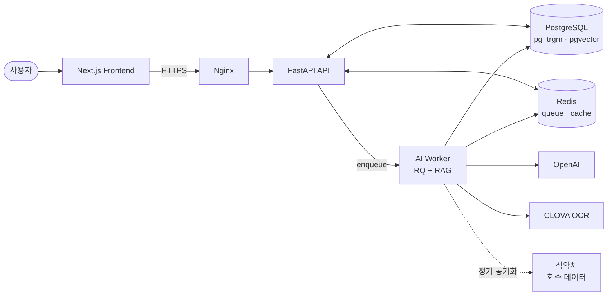
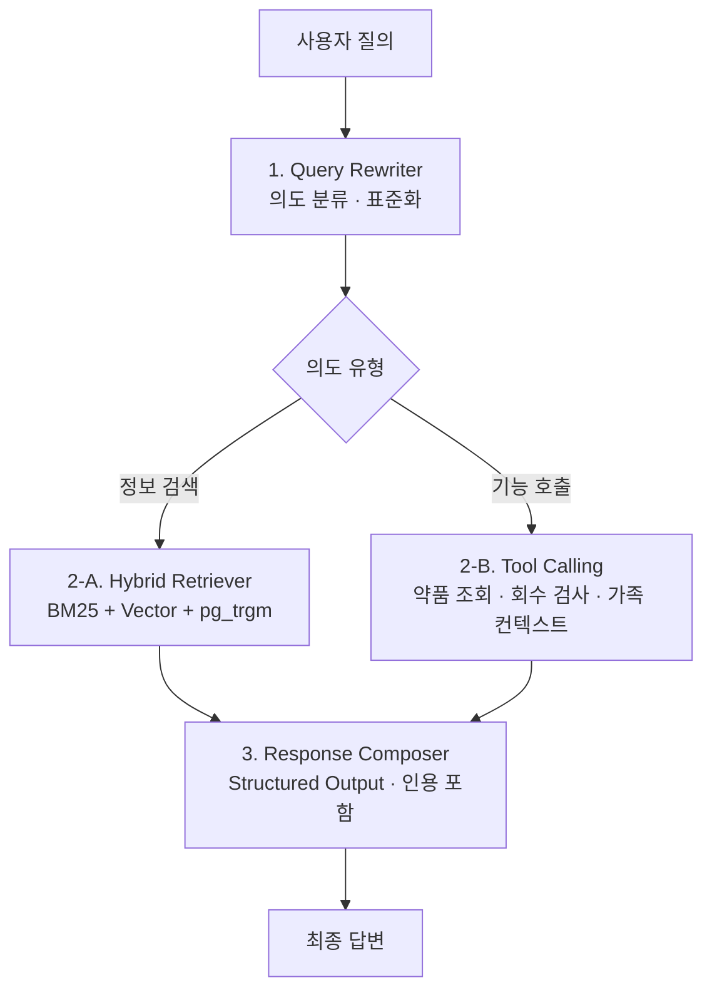

# Doseph


---

## 1. 서비스 소개

### 서비스 개요

- **진행 기간**
  - 팀 프로젝트 기간: 2026-03-30 ~ 2026-05-05 (PR #140 머지)
  - 개인 개선 프로젝트 (v2.x): 2026-05 ~ 진행 중
- **한 줄 소개**: 처방전 사진 한 장으로 OCR 복약 등록 · 회수 의약품 필터 · 복약 가이드를 받고, 가족 단위로 건강 데이터를 함께 관리하는 24시간 AI 헬스케어 챗봇지원 웹 사이트
- **서비스 명**: Doseph

### 원본 / 포트폴리오 분기

본 레포는 부트캠프 4인 팀 프로젝트 Doseph(`v1.0.0-team-final`)를 fork하여 **개인 프로젝트**로 전환했다. 팀 작업 이후 개인적으로 찾은 개선점에 대한 보완을 위한 프로젝트다.

- 원본 팀 레포 (read-only): https://github.com/AI-HealthCare-02/AI_02_06
- 팀 종료 시점 스냅샷: [v1.0.0-team-final Release](https://github.com/kimyeongbin-dev/Doseph/releases/tag/v1.0.0-team-final)
- 개인 개선 로드맵 (v2.x): [ROADMAP.md](./ROADMAP.md)

### 기획 배경

2026년 현재, 일반인들이 처방전과 약 봉투의 정보만으로 **부작용·상호작용·회수 여부**를 지속적으로 추적하기 어렵다. 특히, 가족 중 복약 관리가 필요한 노약자나 영유아가 있으면, 보호자가 이들의 관리를 도와야 한다. 처방 직후엔 의사·약사 설명에 의존하지만, 그 이후 복약 중인 약이 어디까지 안전한지 환자나 보호자가 장기적으로 실시간으로 직접 확인할 수단이 사실상 없다.

이 문제를 **가족 단위 보호자 시나리오**를 포함하여 이 프로젝트에서 끝까지 풀어보고자 했다:

- 처방전 사진 한 장으로 약 정보 추출 (OCR)
- 식약처 회수 데이터와 자동 매칭해 회수 의약품 사전 알림
- 부작용·금기·복약 가이드는 LLM 챗봇이 사용자 정보 기반 안전한 응답 형식으로 안내
- 가족 구성원의 약·증상·생활 습관을 한 사이트에서 통합 관리

### 서비스 화면

> v2.x 배포 이후 GIF · 스크린샷 · 데모 URL 추가 예정.

### 팀 구성

- 개발자 4인 + 멘토 1인 (오즈코딩스쿨 AI 헬스케어 02기)
- 초기 프로젝트 템플릿(`ai_worker`· `FastAPI 스캐폴드` · `Docker 베이스`)은 **부트캠프 제공 공통 스타터킷**
- 본 작업 시작 전, 팀 기술 스택(PostgreSQL · pgvector · aerich 등)에 맞춰 **베이스 재구조화** 후, 그 위에서 본 작업 시작

---

## 2. 기획

### 시스템 아키텍처



### AI 챗봇 파이프라인 — RAG 3-stage (의도 분기형)



| Stage                 | 역할                                                               |
| --------------------- | ---------------------------------------------------------------- |
| 1. Query Rewriter     | 모호한 질의를 의도별로 분류 · 검색 키워드로 표준화                                    |
| 2-A. Hybrid Retriever | 메타데이터 사전 필터 + 키워드(BM25) + 임베딩(halfvec/HNSW) + 오탈자 보정(pg_trgm) 결합 |
| 2-B. Tool Calling     | 약품 정보 · 회수 상태 · 가족 컨텍스트를 함수형 도구로 결합 호출                           |
| 3. Response Composer  | OpenAI Structured Output으로 일관된 응답 스키마 + 인용 메타 포함                 |

---

## 3. 기술 스택

### Backend

- FastAPI
- pydantic · uv
- Tortoise ORM · aerich (migration)

### AI

- OpenAI (Structured Output + Tool Calling)
- CLOVA OCR
- Sentence-Transformers
- 자체 RAG 4-stage hybrid pipeline

### Data

- PostgreSQL 16 (pg_trgm · pgvector halfvec + HNSW)
- Redis (cache · queue)

### Workers

- RQ (Redis Queue)
- SSE long-poll 스트리밍

### Frontend

- Next.js 15 · React
- TanStack Query v5

### Infra

- Docker Compose (dev / prod 분리)
- Nginx (reverse proxy)
- AWS EC2 (팀 시점, 현재 종료 → v2.x에서 무료 스택으로 마이그레이션 예정)
- GitHub Actions CI/CD

---

## 4. 프로젝트 진행

### Git 운영

- 단일 `main` + 단기 feature 브랜치

- PR 리뷰 → main 머지

- Commit convention — Conventional Commits 형식

  ```
  <type>(<scope>): <description>
  ```

  - **type**: `feat` · `fix` · `refactor` · `perf` · `docs` · `test` · `chore` · `style`
  - **scope** (선택): `rag` · `chat` · `ocr` · `medication` · `lifestyle-guide` · `ci` · `db` 등
  - 예시: `feat(rag): 3-stage hybrid retriever 도입`, `fix(ocr): LLM 응답 None safe`

- GitHub Actions로 push/PR 시 자동 lint · test 실행, main 머지 시 deploy 트리거

### 협업

- PR 리뷰 → 모듈 책임 명확화 + 작은 단위 PR 운영으로 머지 충돌 최소화
- 멘토 피드백 사이클 (예: 단순 vector → hybrid 검색 구조로 리팩토링)
- 본인 작업 영역(RAG · 챗봇 · 마이그레이션)은 단독 책임, 도메인 모델은 팀 공유

> 로컬에서 직접 띄워 보고 싶으면 `v1.0.0-team-final` 태그 시점 README와 `docs/` 폴더의 setup 가이드 참고.

---

## 5. 본인 기여

> 팀 작업 기간 동안 나는 이 팀 프로젝트에서 무엇을, 얼마나 했는가?

### 5.1 정량 기여

| 지표      | 값                                    |
| ------- | ------------------------------------ |
| 팀 작업 기간 | 2026-03-30 ~ 2026-05-05 (PR #140 머지) |
| 본인 커밋   | **582 / 823 (71%)**                  |
| Git 이름  | `kimyeongbin-dev`                    |

### 5.2 주요 작업 회고

> 본인이 주도한 영역들. **시작점 → 접근·사고 흐름 → 구현 → 결과** 순으로 정리.

#### A. 초기 베이스 재구조화 — MySQL → PostgreSQL, ERD 전면 개편

**시작점.** 부트캠프 스타터킷은 `FastAPI + MySQL + Tortoise + alembic` 조합. 팀이 결정한 기술 스택은 `PostgreSQL + pgvector + aerich` — RAG 본격 도입을 위해 벡터 DB가 필요했다.

**접근 · 사고 흐름.**

- DB 엔진: MySQL → PostgreSQL (pgvector 호환 위해)
- 마이그레이션 도구: alembic → aerich (Tortoise 공식)
- ERD: 가족 단위 권한 · 채팅 세션 · 챗 메시지 메타 등 본 작업 요구사항 반영해 처음부터 재설계

**구현.**

- `MySQL → PostgreSQL 전환` (`b800dde`)
- `ERD 전면 개편에 따른 인증/캐시 모델 재구성` (`bdd93b1`)
- `pre-commit 자동화 + .gitattributes 설정` (`5249a92`)
- 마이그레이션 32+개 누적 (halfvec · pg_trgm · drug_recalls · jsonb 등 핵심 단계 본인 작성)

**결과.** 팀 본 작업이 즉시 RAG/벡터 검색을 도입할 수 있는 상태에서 출발. 도메인 요구사항(가족 단위, 챗 세션 메타)이 ERD에 처음부터 반영돼 후속 작업 마찰이 적었다.

---

#### B. RAG Hybrid 파이프라인 (3-stage 의도 분기형)

**시작점.** 초기엔 단순 벡터 검색만으로 RAG. **한글 약품명 검색에서 retrieval 누락**이 잦았다. 사용자가 "타이레놀"이라 입력해도 "타이레놀정 500mg" 청크가 안 잡히거나, 오탈자가 있으면 즉시 빠졌다.

**접근 · 사고 흐름.**

- 단일 vector → 표면 어휘 불일치에 약함
- **BM25** 결합 → 키워드 직접 매칭 보완
- **pg_trgm** → 한글 오탈자 / 부분 매칭 보완
- 3개 신호를 hybrid scoring으로 합성
- 의도 분기: 정보 검색 → Hybrid Retriever / 기능 호출 → Tool Calling

**구현.**

- `pgvector halfvec` 도입 (3072차 vector → halfvec, 인덱스 메모리 절감)
- `HNSW` 인덱스 (`m`, `ef_construction` 튜닝)
- BM25 (Postgres tsvector + `ts_rank`)
- `pg_trgm` extension + GIN 인덱스 (`feat(api): GET /api/v1/medicines/suggest`)
- 임베딩 토큰 최적화: HTML 태그·엔티티 정제로 **토큰 60% 절감**
- OpenAI Batch API 통합 → 임베딩 비용 **추가 50% 절감**

**구조도.** 위 [AI 챗봇 파이프라인 다이어그램](#ai-챗봇-파이프라인--rag-3-stage-의도-분기형) 참고.

**결과.** 약품명 매칭 정확도가 체감 수준에서 개선. halfvec + Batch API로 비용·메모리 부담도 동시에 감소.

---

#### C. 챗봇 코어 — Tool Calling + Structured Output + SSE 스트리밍

**시작점.** LLM이 자유 텍스트로 응답하면 (1) 프런트엔드 파싱·검증 코드가 무거워지고, (2) 인용 메타가 응답마다 일관성 없고, (3) 도메인 안전 룰(예: 임신·수유 컨텍스트 금지 표현)을 적용하기 어려웠다. 스트리밍을 WebSocket으로 깔자니 인프라 부담이 컸다.

**접근 · 사고 흐름.**

- OpenAI **Structured Output** → JSON 스키마 강제로 응답 구조 고정
- **Tool Calling** → 약품 조회 · 회수 검사 · 가족 컨텍스트 · 위치 검색 같은 도메인 함수를 LLM이 명시적으로 호출
- **intent_orchestrator** → 사용자 의도 분기 (`recall_check`, `location_search` 등)
- 스트리밍은 WebSocket 대신 **SSE long-poll** → Nginx 한 단계만 거치면 됨, 모바일 안정적

**구현.**

- 응답 스키마 + 인용 메타 정의
- Tool 함수: `drug_info_lookup` · `recall_check` · `family_context_fetch` · `medicine_search` · `location_search` (카카오 맵 연동)
- `_PERSONA_AND_RULES` — 의료 안전 룰 명시 ("일반적으로 안전" 류 절대 금지)
- RED 테스트 (`test(chat): recall_check 의도 분류 + 분기`)
- `message_service.py` orchestration — RAG 결과 + Tool 결과 + Structured Output 합성

**결과.** 응답 후처리가 단순해지고 인용 출처 일관성 확보. 안전 룰 위반 응답 감소. 인프라 한 단계 단순화 (WebSocket 인프라 회피).

---

#### D. 카카오 OAuth + 가족 권한 모델

**시작점.** 가족 단위 헬스케어 = "본인" 외 "가족 구성원"의 약·증상·챌린지를 보호자가 함께 관리. 어떤 데이터가 어느 프로필 소속인지 명확히 분리돼야 했다 (노약자·영유아 대리 시나리오).

**접근 · 사고 흐름.**

- 카카오 OAuth 전체 플로우 (콜백 → 신규는 설문 onboarding, 기존은 메인)
- `User : Profile = 1 : N` 관계 — SELF / FAMILY 구분
- `ChatSession`이 어떤 `profile_id` 기반인지 명시 (가족 약 조회 시)

**구현.**

- `services/oauth.py` + `apis/v1/oauth_routers.py` + `dtos/oauth.py`
- `profile_relation_v2` 마이그레이션 (가족 관계 정합성)
- 카카오 콜백 redirect 분기 (`fix(auth): 첫 로그인 시 /survey -> /main?showSurvey=true`)
- ChatModal에서 현재 active profile 컨텍스트를 LLM 호출에 전달

**결과.** 보호자가 가족 구성원의 약·증상·생활 습관을 한 곳에서 관리. 도메인 차별화 포인트 (단순 약 관리 앱과의 결정적 차이).

---

#### E. 인프라 구축 · 운영 — Docker · CI/CD · 환경 분리

**시작점.** 4명 동시 개발에서 dev 환경 일관성이 깨지면 마찰이 컸다. 배포는 동시 머지로 중복 deploy가 우려됐고, 환경변수 / DB 호스트 / 로그 경로를 dev/prod 분리해야 했다.

**접근 · 사고 흐름.**

- **Docker Compose dev/prod 분리** — 동일 코드, 다른 env/볼륨
- **GitHub Actions CI/CD** — PR 시 lint + test, 머지 시 deploy 트리거
- main push **concurrency 차단** — 중복 deploy 방지
- **Nginx reverse proxy** — HTTPS + SSE long-poll 패스스루
- 컨테이너 로그를 호스트 볼륨에 마운트 + 배포 시 한 세대 백업

**구현.**

- `docker-compose.yml` / `docker-compose.prod.yml` (dev 88% · prod 100% 본인)
- `.github/workflows/deploy.yml` — `concurrency: cancel-in-progress`
- aerich migration 자동 적용 (deploy 단계 `aerich upgrade`)
- pre-commit (ruff lint/format)
- `RotatingFileHandler` + `logs.prev` 백업 사이클

**결과.** 4인 동시 개발에서 환경 마찰 최소화, 배포 안정성 확보. v2.x 무료 스택(Oracle ARM · Vercel · Neon · Upstash) 마이그레이션도 같은 패턴으로 옮길 수 있는 베이스 마련.

---

### 5.3 협업 · 의사결정 사례

- 4인 팀에서 PR 리뷰 · 머지 운영 (`.github/workflows`, `PULL_REQUEST_TEMPLATE.md`)
- 멘토 피드백 기반 RAG 구조 개편 (단순 vector → hybrid) — 동작하는 코드를 갈아엎는 결정의 기준을 학습
- 모듈 책임 명확화 + 작은 단위 PR로 충돌 최소화
- 통합 PR (`integration/team-prs-2026-05-04` 등) 운영으로 회귀 잡고 컨벤션 정리

---

## 6. 개선 로드맵 (v2.x)

팀 작업이 끝난 뒤에도 "이건 다음에 꼭 다시 보자" 싶었던 것들이 남았다. v2.x로 버전을 끊어서 차근차근 개선하는 중. 각 버전 시작 전에는 `PLAN_v2_X.md`로 사전 설계.

- **v2.0 — 일단 다시 띄우기.** 팀 시점에 쓰던 EC2가 종료돼서, 무료 스택(Oracle Cloud ARM + Vercel + Neon + Upstash)으로 옮겨서 다시 살리기.
- **v2.1 — Quick wins.** 루트에 남은 팀 시점 잔재(`PLAN_*.md`, `.sql` dump, `.pem`, 로그) 정리. AI 에이전트 지침(CLAUDE/AGENTS/GEMINI) 단일 source로 묶기.
- **v2.2 — 모노레포 구조 재설계.** 2026 기준 best example 참조해서 디렉토리 layout 갱신. `app/core` ↔ `ai_worker/core` 중복도 같이 정리.
- **v2.3 — 회귀 안전망.** v2.0~v2.2 직후라 가장 위험한 구간. 핵심 user flow 5종 Playwright E2E + 백엔드 coverage 60% + mypy strict 확대.
- **v2.4 — 백엔드 성능.** 단계별 p50/p95 측정 인프라부터 깔고, 핫스팟 1~3개 개선. halfvec HNSW 튜닝 + N+1 정리.
- **v2.5 — 클린 코드.** 현재 `pyproject.toml` 에 ignore된 룰 점진 해제. 300줄 초과 파일 분할. per-file ignore 해소.
- **v2.6 — FE UX.** SSE streaming UX, 모바일 반응형, 접근성(axe-core), Lighthouse mobile ≥ 90.

> 상세 계획 · 체크박스 · DoD는 [ROADMAP.md](./ROADMAP.md), 매듭지은 버전은 [Releases](https://github.com/kimyeongbin-dev/Doseph/releases) 페이지에 정리.

---

## 7. 느낀점

### 처음 풀고 싶었던 문제

가까운 가족이 약을 새로 받아 오면 약 봉투를 같이 들여다보는 게 일이었다. 의사·약사가 설명을 해주는데도, 그 약을 며칠 더 먹어도 괜찮은지 / 다른 약·음식과 같이 먹으면 안 되는 게 뭔지 / 회수 의약품 명단에 올라간 적 있는지를 일반인이 정리된 형태로 들고 있을 방법이 없었다. 약마다 매번 검색해 보는 것도 쉽지 않다. **그 갭을 가족 단위로 묶어서 풀어보고 싶었다.**

### 기술적으로 막힌 곳 / 풀어낸 곳

처음엔 단순 벡터 검색만으로 RAG를 돌렸는데, **한글 약품명의 오탈자나 동의어**에 약해서 사용자가 검색했다고 생각한 약이 retrieval에서 빠지는 경우가 잦았다. 멘토 피드백을 받아 **BM25 + 벡터 + pg_trgm**을 결합한 hybrid 구조로 옮겼고, 약품명 일치도가 체감 수준에서 개선되었다.

다음 고민은 **인덱스 메모리와 빌드 시간**. full vector(3072차) 그대로 들고 가니 인덱스가 무거웠는데, **halfvec + HNSW**로 옮기면서 메모리·빌드 시간을 줄이면서도 검색 품질 손실은 작았다. 비용 효율 측면에서 가장 큰 결정이었다.

LLM 응답 일관성은 **Structured Output + Tool Calling**으로 잡았다. 자유 텍스트 응답을 JSON 스키마로 강제하면서 프런트엔드의 응답 처리·검증 코드가 단순해졌고, 인용 메타도 안정적으로 따라붙었다.

스트리밍은 WebSocket 대신 **SSE long-poll**로. 인프라가 한 단계 단순해졌고 (Nginx만 거치면 됨), 모바일 환경에서도 안정적이었다.

### 협업에서 배운 것

4인 팀이라 PR 충돌 관리가 생각보다 큰 비용이었다. **모듈 책임을 명확히 나누고 작은 단위로 자주 머지**하는 패턴이 효과가 컸다. 큰 PR은 리뷰 정체를 만들고, 정체된 PR은 또 다른 PR과 충돌해서 일이 누적되는 식이었다.

멘토 피드백을 받아 **이미 돌아가는 코드를 갈아엎는 결정**(vector → hybrid)을 내린 게 가장 값진 경험이었다. "지금 코드가 동작하긴 하지만 다음 단계에서 더 큰 비용을 만들 거다"는 판단 기준을 그때 처음 명확히 다듬은 것 같다.

### 다음에 또 하면 달리 할 것

- **정량 지표를 처음부터 측정**하기. RAG p50, OCR 매칭 정확도, halfvec 도입 전후 메모리 절감 % 등을 측정 인프라 같이 깔고 시작했어야 했다. v2.4(백엔드 성능) 단계에서 측정 인프라부터 깔고 핫스팟을 잡을 계획.
- **테스트 커버리지를 처음부터**. 마지막 주에 회귀 잡느라 시간을 많이 썼다.
- **배포 환경을 처음부터 무료/저비용 스택으로**. EC2가 종료된 지금 다시 띄우려면 또 손이 간다 — v2.x에서 Oracle ARM + Vercel + Neon + Upstash 조합으로 갈 예정.

---

## 8. 크레딧 · 라이선스

- **팀 구성**: 개발자 4인 + 멘토 1인 (오즈코딩스쿨 AI 헬스케어 02기 6팀).
- **초기 템플릿**: 부트캠프 제공 공통 스타터 템플릿
- **부트캠프**: OZ Coding School (오즈코딩스쿨) AI 헬스케어
- **데이터 출처**: 공공데이터포털 (식약처 의약품 목록, 식약처 의약품 회수 데이터 등)
- **AI 외부 서비스**: OpenAI · CLOVA OCR

> 본 fork는 본인의 학습 · 포트폴리오 목적이며, 원본 팀 작업물의 권리는 팀 구성원에게 있습니다.
