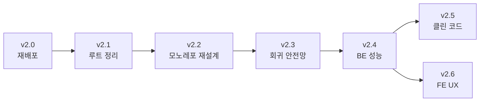

# ROADMAP — DownForce v2.x

> 팀 프로젝트 [`v1.0.0-team-final`](https://github.com/kimyeongbin-dev/DownForce/releases/tag/v1.0.0-team-final) (2026-05-05 종료) 이후
> 개인 포트폴리오로서의 개선 계획. 팀 시점 회고와 정량/정성 기여는 [README.md](./README.md) §5, §7 참조.

본 문서는 v2.x 시리즈의 **단일 source-of-truth**다. 진행 상태는 아래 체크박스로 추적하고, 각 버전 시작 전에는 별도 `PLAN_v2_X.md`를 작성한 뒤 작업한다 ([CLAUDE.md §1.1](./CLAUDE.md)).

---

## 한눈에 보기

| 버전     | 테마                                | 크기  | 상태          | 종료 기준 (요약)                                         |
| ------ | --------------------------------- | --- | ----------- | -------------------------------------------------- |
| v2.0   | 무료 스택 재배포                          | 중-대 | 계획          | 외부 URL 한 줄로 full flow 동작 + 인프라 비용 0               |
| v2.1   | Quick wins — 루트/문서/AI 지침 정리       | 소   | 대기 (v2.0)   | 루트 트래킹 항목 ≤ 20개 + 잔재 파일 0개                        |
| v2.2   | 모노레포 구조 재설계 + 마이그레이션              | 중-대 | 대기 (v2.1)   | best example 비교 + 새 구조 적용 + CI/E2E green          |
| v2.3   | 정상 동작 재확인 및 테스트 (회귀 안전망)          | 중   | 대기 (v2.2)   | 핵심 user flow 5종 E2E green + coverage ≥ 60%        |
| v2.4   | 백엔드 성능 — 측정 + RAG/DB 핫스팟 개선       | 중   | 대기 (v2.3)   | 단계별 p50/p95 측정 + 핫스팟 1~3개 개선 수치 기록                |
| v2.5   | 클린 코드 — Ruff ignore 해제 + 분할       | 소-중 | 대기 (v2.4)   | Ruff ignore ≥ 3개 해제 + 300줄 초과 파일 0개               |
| v2.6   | FE UX 개선 — streaming / 모바일 / 접근성  | 중   | 대기 (v2.4)*  | Lighthouse mobile ≥ 90 + axe-core CI 통합           |

*v2.6은 v2.4 완료 후 v2.5와 병렬 진행 가능.

---

## v2.0 — 무료 스택 재배포

### 배경
팀 시점 AWS EC2가 종료되어 라이브 데모 부재. 개인 포트폴리오 + 장기 운영을 가정해 **인프라 비용 0원** 스택으로 재배포한다. README §1 "서비스 화면"이 비어있는 상태도 본 단계에서 해소.

### 목표
- 외부 URL 한 줄로 데모 가능 (카카오 로그인 → OCR → 챗봇 응답)
- 월 인프라 비용 = 0원 (LLM/OCR API 사용량분만 본인 부담)
- 1~2년 단위로 만료/이주 부담 없는 always-free 스택

### 후보 스택
| 레이어             | 후보                                              | 비고                                                |
| --------------- | ----------------------------------------------- | ------------------------------------------------- |
| FE              | Vercel Hobby                                    | Next.js 15 first-class, 100GB/월 대역폭              |
| BE / Worker     | Oracle Cloud Always Free (ARM Ampere A1, 4 vCPU + 24GB) | 진짜 평생 무료, Docker Compose 그대로 이식                 |
| DB              | Neon (PostgreSQL 16 + pgvector)                 | free tier 0.5GB / 1 compute — pgvector·pg_trgm 지원 확인 |
| Redis / Queue   | Upstash Redis                                   | free tier 10K cmd/day · 256MB — RQ 호환성 검증 필요     |
| LLM             | OpenAI (기존)                                      | 본인 키, 사용량 과금                                      |
| OCR             | CLOVA OCR (기존)                                  | 본인 키, 사용량 과금                                      |
| Reverse Proxy   | Caddy on Oracle ARM (또는 Nginx 유지)               | Let's Encrypt 자동                                  |
| Domain          | DuckDNS / Cloudflare Tunnel                     | 무료                                                |

### 작업 단계
- [ ] Oracle Cloud Always Free 계정 + ARM 인스턴스 프로비저닝
- [ ] Neon Postgres 인스턴스 + `pgvector` / `pg_trgm` extension 활성화 검증
- [ ] Upstash Redis 연결 + RQ 호환성 검증 (free tier command 한계 측정)
- [ ] `docker-compose.prod.yml` 환경변수 + 호스트 매핑 수정 (DB/Redis 외부화)
- [ ] GitHub Actions `deploy.yml` 의 ghcr.io org를 본인 user namespace로 이전 (`ai-healthcare-02` → `kimyeongbin-dev`)
- [ ] EC2 SSH deploy → Oracle ARM SSH deploy 로 secrets 교체
- [ ] Vercel에 `medication-frontend` 배포 + API 도메인 환경변수 연결
- [ ] aerich 마이그레이션 Neon에 1회 적용 + drug data seed (축소판 우선)
- [ ] HTTPS + SSE long-poll 패스스루 검증
- [ ] README §1 "서비스 화면" 섹션 채우기 (GIF + 데모 URL)

### Definition of Done
- 외부 URL 한 줄로 full flow 동작
- 월 청구액 = LLM / OCR API 사용량분만
- README §1 서비스 화면 + 데모 URL 갱신

### 리스크 / 미해결
- Upstash free tier 10K cmd/day가 RQ broker 부하를 견디는지 사전 측정 — 한계 시 Redis self-host(Oracle ARM 컨테이너)로 fallback
- Neon free tier 0.5GB로 `medicine_chunk` 33K + halfvec(3072d) embedding 용량 산정 — 한계 시 chunk 축소 또는 Supabase로 전환

---

## v2.1 — Quick wins · 루트/문서/AI 지침 정리

### 배경
큰 구조 개편(v2.2) 전, **빠르게 해소 가능한 정리**부터 먼저. 후속 PR이 진단/탐색에 쓸 시간을 줄여준다.

### 목표
- 루트 진입점 정리 (현재 40+ 항목 → 20개 이하)
- 팀 시점 운영 잔재 0개 (`.sql` dump, `.pem`, `.log`, `nul`)
- AI 에이전트 지침 (CLAUDE/AGENTS/GEMINI × 4세트 = 12개) 단일 source 검토

### 작업 단계
- [ ] `PLAN_*.md` (5개) → `docs/plans/archive/` 이동 또는 `.gitignore` 추가
- [ ] `aerich_prod.sql` · `final_utf8_dump.sql` · `downforce-key.pem` · `*.log` · `nul` → tracked 여부 확인 후 `git rm` (gitignore에 일부 등록되어 있으나 이미 트래킹된 경우 명시 제거 필요)
- [ ] `테스트 계획.md` → 영문 파일명 + `docs/` 이동
- [ ] AI 지침 통합 정책 결정
  - 옵션 A: 루트 1세트만 유지 + 하위 디렉토리는 짧은 reference로 축약
  - 옵션 B: 단일 source(`docs/ai_guidelines.md`) + generator로 CLAUDE.md / AGENTS.md / GEMINI.md 생성
- [ ] README 링크 dead link 검사 (이미 ROADMAP.md 추가로 해소됨)

### Definition of Done
- 루트 트래킹 항목 ≤ 20개
- 운영 잔재 파일 트래킹 0개
- AI 지침 정책 적용 (지침 파일 ≤ 4개)

### 리스크 / 미해결
- `aerich_prod.sql`은 운영 dump일 가능성 — `git rm` 전에 민감 정보(이메일/토큰 등) 흔적 검사 필요
- 이미 push된 민감 파일(`*.pem`)은 history에서도 제거해야 안전 — git filter-repo 사용 여부는 별도 결정

---

## v2.2 — 모노레포 구조 재설계 + 마이그레이션

### 배경
v2.1로 잔재가 정리된 뒤, **2026 기준 best example을 참조해 본격 구조 개편**. 큰 `git mv`는 차후 PR 충돌 비용이 크므로 v2.3(테스트) 시작 전에 매듭짓는다.

### 목표
- 2026 기준 FastAPI + Next.js 모노레포 best example 적용
- 도구 chain 통합 (Ruff 단일 source, pre-commit, uv workspace 등)
- 공통 모듈 중복 제거 (`app/core` ↔ `ai_worker/core`)

### 조사 대상 (Research Checklist [§10](./CLAUDE.md))
- FastAPI: `tiangolo/full-stack-fastapi-template` (2025-2026 active), `zhanymkanov/fastapi-best-practices`
- Python 모노레포: `uv` workspace 기능 (uv 0.5+), `python-monorepo-template`
- Next.js 15 App Router: `vercel/next.js/examples/with-docker`, Server Actions 패턴
- 모노레포 도구: Turborepo / Nx / Moon — 본 프로젝트 규모에 over-engineering 여부 판단

### 작업 단계
- [ ] 외부 best example 3종 이상 조사 + 비교표 (`docs/2026_structure_research.md`, 출처 + 연도 명시)
- [ ] 모노레포 구조 결정 (옵션 비교 → `PLAN_v2_2.md`)
  - 옵션 A: 현 평면 유지 (`app/`, `ai_worker/`, `medication-frontend/`)
  - 옵션 B: `services/{api,worker}` + `apps/web`
  - 옵션 C: `uv` workspace + Turborepo
- [ ] `app/` 내부 layer 경계 강화 (Router → Service → Repository → Model 누수 제거)
- [ ] `app/core` ↔ `ai_worker/core` 중복 제거 (`packages/shared` 또는 uv workspace dep)
- [ ] `git mv`로 history 보존
- [ ] CI 그대로 통과 + 데모 URL full flow 회귀 없음
- [ ] `ARCHITECTURE.md` · `SYSTEM_DESIGN.md` 갱신

### Definition of Done
- best example 비교 문서 + 새 구조 적용
- 공통 모듈 중복 ≤ 1곳
- CI/CD green + 라이브 데모 회귀 없음
- 설계 문서 갱신

### 리스크 / 미해결
- 큰 `git mv` 후 IDE / Docker volume / aerich migration path가 깨질 수 있음 — `PLAN_v2_2.md`에 사전 영향도 명시

---

## v2.3 — 정상 동작 재확인 및 테스트 (회귀 안전망)

### 배경
v2.0(인프라 교체) + v2.1/v2.2(구조 개편) 직후 회귀 위험이 가장 큰 구간. 팀 시점 마지막 주에 회귀 fix를 몰아 처리했던 경험 ([README §7](./README.md#7-느낀점)) 재발 차단.

### 목표
- 핵심 user flow 5종 자동화 검증
  1. 카카오 로그인 + 첫 설문 분기
  2. 처방전 OCR → 약 등록
  3. 챗봇 RAG 응답 (Structured Output)
  4. 회수약품 알림 (`recall_check`)
  5. 가족 프로필 전환 + context 격리
- 백엔드 단위 테스트 coverage baseline 측정 + 점진 개선
- mypy strict 통과 영역 확대 (현재 `app.models.*`, `tests.*` 등 override 中)

### 작업 단계
- [ ] 현 시점 coverage 측정 + baseline 기록 (`docs/v2.3_coverage_baseline.md`)
- [ ] 핵심 user flow 5종 E2E 테스트 도입 (Playwright on Next.js)
- [ ] 백엔드 비즈니스 로직 단위 테스트 보강 (intent / RAG / OCR 파이프라인 우선)
- [ ] CI에 coverage threshold gate 추가 (60% → 점진 ↑)
- [ ] aerich downgrade / upgrade 양방향 smoke test (CI)
- [ ] LLM 응답 schema validation 회귀 테스트 (Structured Output 깨짐 즉시 감지)
- [ ] `pyproject.toml` mypy override 1~2개 해제 검토

### Definition of Done
- 5종 user flow E2E green
- 백엔드 coverage ≥ 60% (baseline 대비 명시적 ↑ 폭 기록)
- CI 평균 시간 ≤ 5분 유지
- mypy override 최소 1개 해제

---

## v2.4 — 백엔드 성능 (측정 + 핫스팟 개선)

### 배경
v2.3까지 안전망(테스트 + coverage gate)이 깔린 상태에서 **측정 → 개선 → 검증** 사이클로 진행. 정량 수치로 회귀 여부 판정.

### 목표
- RAG 파이프라인 단계별 p50 / p95 측정 인프라 구축
- 측정 결과 기반으로 핫스팟 1~3개 선정 + 개선
- DB 쿼리 N+1 / index miss 제거

### 작업 단계
- [ ] 관측성 baseline — 단계별 latency 로깅 (Query Rewriter / Retriever / Composer / OCR)
- [ ] RAG 파이프라인 p50 / p95 측정 (실 사용자 트래픽 또는 reproducible scenario)
- [ ] N+1 쿼리 감지 (Tortoise `prefetch_related` 갭) + 수정
- [ ] OpenAI 호출 cache 영역 식별 (Structured Output schema, persona prompt)
- [ ] halfvec HNSW 파라미터 (`m`, `ef_search`) 튜닝 + 전후 recall@k 측정
- [ ] 정량 결과 → `docs/v2.4_performance_report.md` + README §5 수치 보강

### Definition of Done
- 단계별 p50 / p95 측정값 문서화
- 핫스팟 ≥ 1개 개선 + 전후 수치 명시
- recall@k 회귀 없음 (개선이면 더 좋음)

### 리스크 / 미해결
- 무료 스택(Neon free tier) 환경에서 측정한 값은 production 절대치로 보기 어려움 — **상대 개선폭**으로 해석한다는 점을 문서에 명시

---

## v2.5 — 클린 코드 (Ruff ignore 해제 + 분할)

### 배경
v2.4로 핫스팟이 정리된 뒤, **코드 자체의 부채를 정리**. 작은 PR 단위로 누적.

### 목표
- 현재 `pyproject.toml` 의 ignore 룰 중 ≥ 3개 해제
- 300줄 초과 파일 분할 ([CLAUDE.md §4.2](./CLAUDE.md))
- per-file ignore 해소 (특히 `app/services/ocr_service.py`)

### 작업 단계
- [ ] 현재 ignore 룰 영향도 측정 (해제 시 발생 violation 수)
- [ ] 우선순위 해제 — `TC001` / `TC002` / `TC003` (type-checking), `RUF012` (mutable class default), `EM101` / `EM102` (exception message)
- [ ] 300줄 초과 파일 검사 + 분할 PR
- [ ] 중복 코드 / `SLF001` 우회 패턴 정리
- [ ] `app/services/ocr_service.py` per-file ignore (F811, ASYNC230, PTH123, E501) 해소
- [ ] `app/repositories/medication_repository.py` · `app/workers/intake_log_worker.py` `DTZ011` (aware datetime) 해소

### Definition of Done
- Ruff ignore 룰 ≥ 3개 해제
- 300줄 초과 파일 0개
- per-file ignore ≥ 2개 해소

---

## v2.6 — FE UX 개선 (streaming · 모바일 · 접근성)

### 배경
v2.4 완료 후 **v2.5와 병렬 진행 가능** — 백엔드 안 건드림. FE 마이크로 개선 + 모바일 + 접근성.

### 목표
- 챗봇 응답 SSE streaming UX 가시화
- 모바일 반응형 점검 (가족 관리 / 처방전 카드 우선)
- 접근성 baseline (axe-core CI 통합)
- Lighthouse mobile ≥ 90

### 작업 단계
- [ ] 챗봇 응답 streaming UI 인디케이터 (SSE 진행 상태 + 부분 응답 점진 표시)
- [ ] OCR 업로드 progress + 실패 retry UX
- [ ] 에러 경계 (React Error Boundary) 도입 — 챗 / OCR / 가족 관리 화면
- [ ] 키보드 nav 점검 (Tab order, focus trap on modal)
- [ ] 모바일 반응형 점검 (가족 관리 / 처방전 카드 → 다른 페이지)
- [ ] axe-core 자동 검사 CI 통합
- [ ] Lighthouse 측정 → 90 미만 항목 우선순위화

### Definition of Done
- Lighthouse mobile ≥ 90
- axe-core CI green
- 핵심 화면 5종 모바일 회귀 없음

---

## 버전별 운영 규칙

- **PLAN 우선**: 각 버전 시작 전 `PLAN_v2_X.md` 작성 + 사용자 승인 후 작업 ([CLAUDE.md §1.1](./CLAUDE.md))
- **태그 + Release**: 각 버전 종료 시 `v2.0.0`, `v2.1.0` annotated tag + GitHub Release 등록
- **회귀 가드**: v2.2(구조 재설계) 전후로 functional snapshot 보조 태그 부착 (`v2.1.0-cleanup` 등)
- **단일 source-of-truth**: 진행 상태는 본 ROADMAP.md 체크박스 — Issues / Projects 미사용
- **병렬 허용**: v2.5와 v2.6은 v2.4 완료 후 병렬 가능 (백엔드 vs 프론트엔드)

---

## 동기화 항목

- [x] [README.md §6](./README.md#6-개선-로드맵-v2x) — v2.0~v2.6 (7개) 라인업으로 정렬 완료 (`docs: v2.x ROADMAP 작성 및 README v2.x 라인업 동기화`)
- [x] [README.md §7](./README.md#7-느낀점) — "관측성·메트릭부터 깔고 갈 계획" → "v2.4 단계에서 측정 인프라부터 깔고 핫스팟 잡을 계획"으로 정렬
