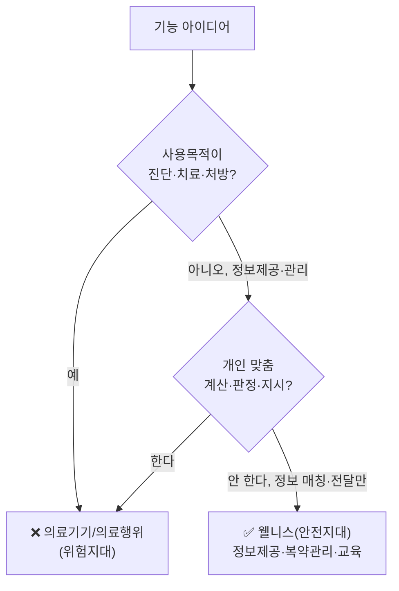
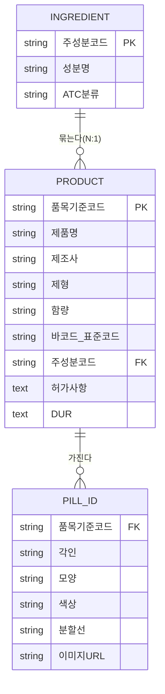
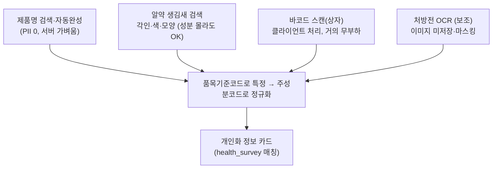

# 서비스 방향성 결정 문서 (Service Direction & Scope)

> 🗓️ 최초 작성 2026-08-08 · 상태: **방향 합의 / 세부 설계 진행 예정**
> 이 문서는 서비스의 **정체성·법적 포지셔닝·데이터 전략·등록 방식**에 대해 지금까지 논의·결정한 내용을 통합 정리한다.
> 관련: 배포 계획 [`docs/plans/v2_0_redeployment.md`](plans/v2_0_redeployment.md) · (개인 학습노트는 `docs-private/`)

---

## 0. 한 줄 정의

> **서비스명: Doseph** (`doseph.com`, 2026-08-08 도메인 확보) — 복약 도우미 캐릭터 컨셉(챗봇 의인화).
> **환자·보호자를 위한 AI 복약 관리 + 의약품 정보 제공(교육) 서비스.**
> 공식 데이터를 바탕으로 "정보를 정리해 보여줄" 뿐, **진단·처방·용량 지시는 하지 않는다(웰니스 범위).**

- **1차 타깃**: 환자, 보호자
- **장기 확장**: 의료진 대상 도구 (규제·신뢰 요구가 커 별도 단계로 분리)

---

## 1. 관점별 고려사항 → 해결방안 (요약표)

| 관점 | 핵심 고민 | 결정된 해결방안 |
|---|---|---|
| **법적(개인정보)** | 건강정보가 민감정보인가? | ✅ 민감정보 확정 → **별도 동의 + 암호화 + 최소수집** |
| **법적(의료)** | 진단·권유 불가 | ✅ **웰니스 포지셔닝**(사용목적 비의료·저위해도) 유지, 빨간 선 준수 |
| **데이터(유효성/양)** | 공공데이터만으로 유효 데이터 확보 어렵지 않나 | ✅ **정부 전수 마스터 다운로드+조인** — 크롤링 아님 |
| **데이터(정규화)** | 이름 다양해도 같은 약 | ✅ **주성분코드**로 정규화(성분 레이어) |
| **실용성/유효성** | 서버 부담·비용 | ✅ 검색·바코드는 가벼움, **OCR은 보조**로 (무겁고 비용) |
| **사용자 관점** | 환자는 성분을 모름 / 제형·양만으론 특정 위험 | ✅ **품목 단위 특정 + 낱알식별(각인·색·모양)** |
| **목적성** | 무엇을 주는 서비스인가 | ✅ 복약관리 + **공식정보 전달·교육** (판단 아님) |

---

## 2. 법적 포지셔닝

### 2.1 개인정보 — 건강정보는 "민감정보"

- **근거**: 개인정보 보호법 **제23조** + 시행령 **제18조** — "건강"에 관한 정보는 **민감정보**.
- **원칙**: 민감정보는 처리 금지. **예외** = ① 정보주체의 **별도 동의** ② 법령상 허용.
- **적용**: 알레르기·질환·임신여부·복용약·신체정보 등은
  - **별도 동의 항목 분리** (일반 회원가입 동의에 뭉치면 안 됨)
  - **암호화 저장 · 최소 수집 · 목적 외 사용 금지**
  - 현재 `health_survey` 수집 구조 활용, **동의 UI만 분리** 필요.

### 2.2 의료 — 웰니스(비의료) 범위 유지

- **근거**: 식약처 「의료기기와 개인용 건강관리(웰니스) 제품 판단기준」 — **사용목적(의료용/비의료용) + 위해도**로 판단.
- 우리 포지션(정보 전달·복약관리, 진단·계산·지시 배제) = **비의료용 + 저위해도 → 웰니스**.



### 2.3 빨간 선 — "계산·판정·지시" 금지

| ✅ 안전 (정보 매칭·전달) | ❌ 위험 (의학적 판단) |
|---|---|
| "허가사항에 ~로 **기재**되어 있어요" | "이 약 **드시지 마세요**" (지시) |
| "DUR 임부금기로 **등재**" | "당신은 **비만입니다**" (판정) |
| "체중 kg당 ○mg **원문 표시**" | "60kg이니 **300mg 드세요**" (용량 계산) |
| "전문가와 상담하세요" 유도 | "신기능 낮으니 **용량 줄이세요**" (조절 제안) |

### 2.4 안전 설계 5원칙

1. **출처 명시** — 모든 개인화 정보에 "식약처 허가사항/DUR" 출처 표기
2. **판단·지시 배제** — "기재/등재되어 있어요"(○) / "하세요·하지 마세요"(✗)
3. **전문가 상담 유도** — 항상 "의사·약사와 상담"으로 마무리
4. **"앱이 진단한 게 아님" 명시** — "회원님이 입력하신 정보 기준"
5. **응급 배제 고지** — "응급상황은 즉시 119/의료기관"

> ⚠️ 본 문서는 법률 자문이 아니다. 출시 전 **개인정보 별도 동의 문안**과 **웰니스 판단기준 최신 개정본**을 전문가/공식 출처로 확인할 것.

---

## 3. 개인화 정보제공 (건강정보 반영)

수집 항목: 알레르기, 질환(고혈압·저혈압·심장·신장·간 등), 임신여부, 성별, 나이, 키, 체중, 흡연·음주·운동 여부.

| 항목 | 공식정보 연결 | 활용(안전) | 주의(빨간 선) |
|---|---|---|---|
| 임신여부 | 강 (DUR 임부금기) | "임부 금기 등재" 매칭 | 민감정보 최상급 |
| 나이 | 강 (연령금기) | "고령자 신중투여 기재" | 위험도 "판정" 금지 |
| 음주 | 강 (허가사항) | "음주 주의 기재" 전달 | "끊으세요" 지시 금지 |
| 흡연 | 중 (대사 영향) | "대사 영향 기재" 전달 | 금연 "처방" 금지 |
| 질환(신장·간 등) | 강 (신중투여) | "신장애 신중투여 기재" | eGFR 계산·용량조절 금지 |
| 키·체중 | 용량 관련 | 허가 원문·BMI 단순표시 | **개인 용량계산·비만판정 금지** |
| 운동 | 약 (생활습관) | 일반 건강정보 | "권유" 톤 과하지 않게 |

**안전한 개인화 카드 예시**:
```
💊 리시노프릴정 (성분: 리시노프릴)
회원님 프로필 관련 확인 정보 📄식약처 허가사항·DUR
⚠️ 임신 중 → 임부 금기로 등재
⚠️ 신장질환 있음 → 신장애 환자 신중투여로 기재
ℹ️ 음주 가끔 → 복용 중 음주 주의 기재
※ 회원님 입력 기준 안내이며 진단·처방이 아닙니다. 의사·약사와 상담하세요.
```

---

## 4. 데이터 전략 — 정부 마스터 조인 + 2레이어 정규화

### 4.1 핵심 통찰

유효 데이터는 **직접 수집(크롤링)이 아니라, 정부 공식 전수 마스터를 다운로드해 조인**한다. `data.go.kr`에서 로그인 없이 파일/오픈API 제공, 정기 갱신(파일명에 기준일자).

| 데이터셋 | 제공 | 역할 |
|---|---|---|
| 묶음의약품정보서비스 | 식약처 | 품목기준코드 ↔ **대표 주성분·심평원 주성분코드·ATC** (조인 다리) |
| 약가마스터_의약품주성분 | 심평원 | **주성분코드** 마스터 |
| 약가마스터_의약품표준코드 | 심평원 | **바코드(표준코드)** |
| ATC코드 매핑 목록 | 심평원 | 성분→ATC 분류 |
| 의약품안전나라(nedrug) | 식약처 | **낱알식별**(각인·모양·색·이미지)·허가사항·DUR |

> 프로젝트는 이미 data.go.kr(Dtl06 허가상세) + `medicine_info`/`medicine_chunk`(RAG) 적재 경험이 있어, 27건 샘플을 **전체 마스터로 확장 + 성분코드/ATC/낱알식별 축 추가**만 하면 된다.

### 4.2 2레이어 데이터 모델

식별(정확·안전)과 묶음(정규화)을 분리한다.



- **레이어 1 · 품목(PRODUCT)** = 사용자가 "특정"하는 단위. 눈에 보이는 것(제품명·낱알식별·바코드)으로 찾음.
- **레이어 2 · 성분(INGREDIENT)** = "같은 약"을 묶는 단위. 주성분코드가 같으면 자동으로 동일 약. 정보 카드 재사용.

### 4.3 우려 3가지가 풀리는 방식

- **환자가 성분을 모름** → 레이어 1(제품명/알약 생김새)로 찾고, 성분코드는 시스템이 뒤에서 부착.
- **제형·양만으론 특정 위험** → 특정은 **품목기준코드 + 낱알식별(각인=사실상 지문)** 로 정확도 확보.
- **같은 약 묶기** → **주성분코드**로 자동 그룹화.

---

## 5. 등록 방식 — 여러 입구 → 하나의 정규화 DB



| 방식 | 개인정보 | 서버부담 | 특징 |
|---|---|---|---|
| 이름/성분 검색·자동완성 | 없음 | 낮음 | **1순위**, 커버리지 넓음 (`pg_trgm` 인덱스) |
| 바코드 스캔 | 없음 | **최저**(클라) | 상자 있는 약 |
| 낱알식별 검색 | 없음 | 중 | 성분 모르는 환자·조제약 |
| 처방전 OCR | **많음** | **높음+비용** | **보조 옵션**, 이미지 미저장 |
| 마이데이터 연계 | 동의기반 | 낮음 | 신뢰 최고이나 **제도·인증 장벽 큼 → 장기 로드맵** |

> **서버부담 관련 교정**: 무거운 것은 이름 검색이 아니라 **AI 연산(임베딩·LLM)·OCR**이다. 텍스트 검색·바코드는 가볍다.

---

## 6. 결정된 방향성 (Decisions)

1. **포지셔닝**: 웰니스/정보제공 (진단·처방·용량지시 배제). 빨간 선(계산·판정·지시) 준수.
2. **개인화**: `health_survey` 기반 **정보 매칭·주석** + 출처 + 상담 유도. (계산·판정·지시 금지)
3. **개인정보**: 건강정보 = 민감정보 → **별도 동의 + 암호화 + 최소수집**.
4. **데이터**: 정부 마스터 다운로드+조인, **품목/성분 2레이어 정규화 DB**, 낱알식별 포함.
5. **등록**: 검색·바코드·낱알식별 **우선**, 처방전 OCR **보조**(이미지 미저장), 마이데이터 **장기**.
6. **타깃**: 환자·보호자 우선, 의료진 장기.
7. **배포**: Cloudflare(FE) + Oracle ARM(BE) — [v2_0_redeployment.md](plans/v2_0_redeployment.md) 참조.
8. **네이밍**: **Doseph** 확정 (도메인 `doseph.com` 구매 완료 2026-08-08). ‘Downforce’ 대체. 복약 도우미 캐릭터로 챗봇 의인화 활용.

---

## 7. 미해결 / 다음 단계

| # | 항목 | 비고 |
|---|---|---|
| 1 | 개인정보 **별도 동의 문안** 설계 | 출시 전 전문가 확인 |
| 2 | 정부 마스터 → `medicine_*` **스키마 확장안** | 주성분코드·ATC·낱알식별 축 추가 |
| 3 | **낱알식별 검색 UX** (각인·색·모양 필터) 화면 설계 | 성분 모르는 사용자 대응 |
| 4 | 개인화 정보 카드 **RAG 파이프라인**에 프로필 매칭 반영 | 기존 RAG 확장 |
| 5 | ~~서비스 네이밍~~ → **Doseph** 확정, `doseph.com` 구매 완료 | ✅ 완료 (2026-08-08) |
| 6 | 마이데이터 연계 타당성 | 장기, 제도 요건 재조사 |

---

## 8. 출처

- 개인정보 보호법 제23조(민감정보) — 국가법령정보센터: https://www.law.go.kr/법령/개인정보보호법/제23조
- 개인정보처리자의 민감정보 처리 — 찾기쉬운 생활법령정보: https://www.easylaw.go.kr/CSP/CnpClsMainBtr.laf?popMenu=ov&csmSeq=1257&ccfNo=2&cciNo=3&cnpClsNo=1
- 의료기기와 개인용 건강관리(웰니스) 제품 판단기준 — 식약처(대구청 안내): https://www.mfds.go.kr/brd/m_861/view.do?seq=20156
- 식품의약품안전처_묶음의약품정보서비스 — 공공데이터포털: https://www.data.go.kr/data/15063908/openapi.do
- 심평원_약가마스터_의약품주성분 — 공공데이터포털: https://www.data.go.kr/data/15067461/fileData.do
- 심평원_약가마스터_의약품표준코드 — 공공데이터포털: https://www.data.go.kr/data/15067462/fileData.do
- 심평원_ATC코드 매핑 목록 — 공공데이터포털: https://www.data.go.kr/data/15118958/fileData.do
- 의약품안전나라(nedrug) — 식약처: https://nedrug.mfds.go.kr/searchDrug

---

## 변경 이력

- **2026-08-08**: 최초 작성. 법적 포지셔닝(웰니스·민감정보), 데이터 전략(정부 마스터 2레이어 정규화), 등록 방식(검색·바코드·낱알 우선/OCR 보조), 개인화 안전설계 결정.
