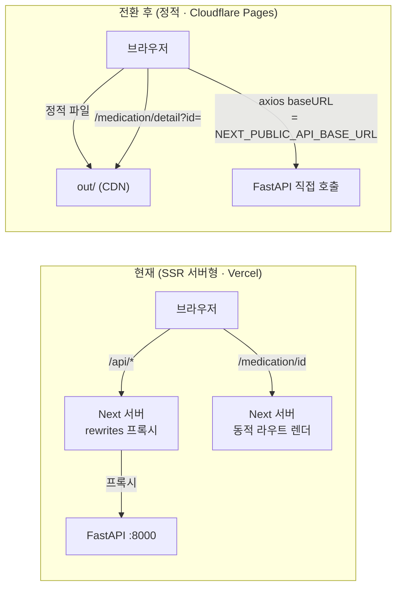
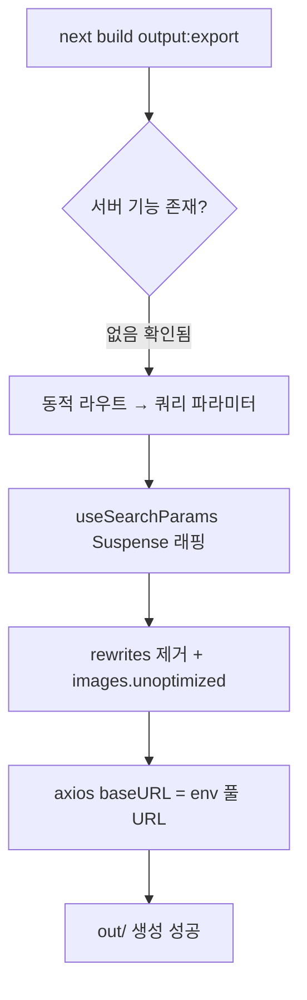

# PLAN — Phase 1: 프론트엔드 정적 export 전환 (빌드 성공 기준)

| 메타 | 값 |
|---|---|
| **수립 시각** | 2026-08-11 20:07 (KST) |
| **완료 시각** | 2026-08-14 18:50 (KST) |
| **Phase** | P1 / 전체 6단계 |
| **상태** | ✅ Green 확정 (E2E 22/22 · ESLint 0 errors · `out/` 생성) · 커밋 분리 대기 |

> **검증 요약(2026-08-14)**: docker 실백엔드(마이그레이션 32개 적용) + 정적 `out/` 서빙(:3000)으로 Playwright E2E 22/22 통과.
> 라우팅 계약(신규 200/구 404/딥링크) · 네비게이션 클릭 이동 · 전 페이지 스모크 검증 완료.

> **버전 기록 규칙**: 완료 시 위 표의 완료 시각을 채운 뒤 이 파일을 `docs/plans/phase1_static_export.md`로 복사(수립·완료 시각 포함 보존)하고, 다음 Phase용 새 `PLAN.md`를 작성한다.

> **큰 범위(Phase) 분할 후 첫 번째 단계.**
> 목표: `next build`가 `output: 'export'`로 `out/` 정적 산출물을 **에러 없이** 생성하고,
> 앱이 환경변수로 지정한 백엔드 URL을 바라보도록 배선한다.
> Cloudflare Pages 배포의 **전제 조건(enabler)** 이며, 이 단계 자체는 인프라/도메인/CORS를 건드리지 않는다.

---

## 0. 전체 Phase 지도 (큰 범위 구분)

| Phase | 범위 | 산출물 | 상태 |
|---|---|---|---|
| **P1** | **정적 export 전환** (next.config·동적 라우트·axios baseURL·Suspense) | `next build` → `out/` 성공 | **← 지금** |
| P2 | 백엔드 포터블화 + CORS/쿠키 크로스오리진 | 정적 FE ↔ 백엔드 크로스오리진 통신 | 대기 |
| P3 | Cloudflare Pages 배포 + `doseph.com` DNS/TLS + Kakao redirect | 실도메인 접속 | 대기 |
| P4 | SSG 랜딩 하이브리드 + SEO(metadata/sitemap/robots) | 랜딩 정적 렌더 + 검색 노출 | 대기 |
| P5 | PWA (manifest·service worker·icons, iOS 제약 문서 연계) | 설치형 웹앱 | 대기 |
| P6 | 성능 측정 (web-vitals / Core Web Vitals / INP) | 계측·표시 | 대기 |

> **운영 규칙**: 각 Phase 완료 시 이 `PLAN.md`(gitignore 스크래치)를 `docs/plans/phaseN_*.md`(커밋 버전기록)로 복사·보관하고, 다음 Phase용 새 `PLAN.md`를 작성한다.
> (이전 RAG 스크래치는 `docs/plans/rag_query_rewriter_hybrid_retrieval.md`로 이미 아카이브함.)

---

## 1. Goal & 완료 기준 (Definition of Done)

- [ ] `medication-frontend/next.config.mjs`에 `output: 'export'` 적용, `next build` **성공**.
- [ ] `rewrites()` 제거로 인한 빌드 에러 없음 (정적 export는 rewrites 미지원).
- [ ] 동적 라우트 `[id]`·`[group_id]` → **쿼리 파라미터** 방식으로 전환, `generateStaticParams` 없이 빌드 통과.
- [ ] `useSearchParams` 사용 페이지 전부 `<Suspense>` 경계로 감싸 빌드 에러 없음.
- [ ] `images.unoptimized: true` — 정적 호스팅에 이미지 옵티마이저 서버 부재 대응.
- [ ] axios가 `NEXT_PUBLIC_API_BASE_URL`(풀 백엔드 URL)을 baseURL로 사용하도록 배선 (동일출처 rewrites 의존 제거).
- [ ] 산출물 `out/`에 각 라우트 HTML 생성 확인 (`out/medication/detail.html` 등).

> **경계선(중요)**: P1은 **빌드·정적 라우팅 성공**까지만 책임진다.
> rewrites를 제거하면 API 호출이 크로스오리진이 되어 **런타임 통신은 P2(CORS/쿠키)** 가 끝나야 정상 동작한다.
> 따라서 P1의 인수 기준은 "빌드 성공 + `out/` 생성 + 로컬 스모크(정적 서빙 렌더)"이고, 실 API 연동 검증은 P2로 넘긴다.

---

## 2. 현재 상태 조사 결과 (근거)

- 페이지 15개 **전부 `use client`** → SSR/SSG 서버 렌더 의존 없음. 정적 export 적합.
- **서버 기능 부재 확인**: `middleware` 없음, `app/**/route.js`(route handler) 없음, `'use server'`(server action) 없음 → export 차단 요소 없음.
- 동적 라우트 **2개**뿐: `medication/[id]`, `medication/groups/[group_id]`. 둘 다 client에서 `useParams()`로 읽고 client fetch → 쿼리 파라미터 전환이 가장 단순.
- 동적 라우트로 push하는 **호출부 2곳**만 존재:
  - `src/app/medication/page.jsx:316` → `router.push(\`/medication/groups/${g.id}\`)`
  - `src/app/medication/groups/[group_id]/page.jsx:257` → `router.push(\`/medication/${medicationId}\`)`
- `useSearchParams` **기존 6개 파일** 사용 중 (Suspense 경계 필요): `lifestyle-guide`, `auth/kakao/callback`, `ocr/result`, `medication/edit`, `mypage`, `main`.
- `next.config.mjs`: `rewrites()`가 `/api/* → localhost:8000` 프록시 담당. `images.unoptimized: false`. `experimental.optimizeCss: true`(critters).
- `src/config/env.js`: `API_BASE_URL`가 `NEXT_PUBLIC_API_BASE_URL ?? ''`. 현재 `''`(동일출처+rewrites) 기본값 → 전환 후 무의미.

---

## 3. 핵심 흐름 (Before → After)

---

## 4. 3-Step 개발 사이클 (Tidy → Test → Implement)

> FE에는 pytest가 없으므로 "Test(Red)"는 **빌드/린트 게이트 + 스모크 체크리스트**로 대체한다.
> 각 스텝 종료 시 사용자 확인을 받는다.

### Step 1 — Tidy First (행위 변화 없음)
- `next.config.mjs` 주석 정리 (Vercel 언급 → 배포중립 표현), import/구조 정돈.
- 동적 라우트 페이지의 불필요 import·죽은 코드 점검.
- **불변식**: 기존 `next build`(현행 설정)가 여전히 통과. 행위 변화 0.

### Step 2 — Test First (검증 기준 확정 = Red)
- 인수 체크리스트 문서화 (아래 §6). 이 시점엔 `output:'export'`로 빌드 시 **실패(Red)** 상태여야 정상:
  - `[id]`/`[group_id]` 동적 라우트가 `generateStaticParams` 없이 export 에러.
  - `useSearchParams` Suspense 미경계 에러.
- 실패 로그를 캡처해 "무엇을 고쳐야 Green인지" 확정.

### Step 3 — Implement (최소 변경으로 Green)
1. `next.config.mjs`: `output:'export'`, `images.unoptimized:true`, `rewrites()` 제거, Vercel 주석 정리.
2. 동적 라우트 전환:
   - `medication/[id]/page.jsx` → `medication/detail/page.jsx` (`useSearchParams().get('id')`).
   - `medication/groups/[group_id]/page.jsx` → `medication/group/page.jsx` (`useSearchParams().get('group_id')`).
   - `[id]`·`[group_id]` 폴더 삭제.
3. 호출부 2곳 경로 수정 (`/medication/detail?id=`, `/medication/group?group_id=`).
4. 신규 쿼리 페이지 + 기존 6개 파일 `useSearchParams` → `<Suspense fallback>` 경계 적용.
5. env 배선(**조사 반영**): `NEXT_PUBLIC_API_BASE_URL=http://localhost:8000`을 **원본** `envs/.local.env`(실값) + `envs/example.local.env`(템플릿, 커밋)에 추가 → `.\env local`로 루트 `.env` 재생성. **루트 `.env` 직접수정 금지**(스위처가 덮어쓰는 파생물). `env.js` 기본값 주석 갱신.
6. `next build` Green 확인 → `out/` 라우트 HTML 검증.

---

## 5. Affected Files

**수정**
- `medication-frontend/next.config.mjs` — export/unoptimized/rewrites 제거
- `medication-frontend/src/app/medication/page.jsx` — 316행 group 경로
- `medication-frontend/src/config/env.js` — baseURL 기본값 주석/정리
- `envs/.local.env` (원본, gitignore) — `NEXT_PUBLIC_API_BASE_URL` 추가
- `envs/example.local.env` (템플릿, 커밋) — 동일 키 추가(값은 예시)
- Suspense 래핑: `lifestyle-guide`, `auth/kakao/callback`, `ocr/result`, `medication/edit`, `mypage`, `main` 각 `page.jsx`

**신규**
- `medication-frontend/src/app/medication/detail/page.jsx`
- `medication-frontend/src/app/medication/group/page.jsx`

**삭제**
- `medication-frontend/src/app/medication/[id]/` (폴더)
- `medication-frontend/src/app/medication/groups/[group_id]/` (폴더)

**문서**
- `docs/db_schema.dbml` — 해당 없음 (모델 변경 없음)

---

## 6. 인수 체크리스트 (Green 기준)

- [ ] `cd medication-frontend && npm run build` → 종료코드 0, `out/` 생성.
- [ ] `out/medication/detail.html`, `out/medication/group.html` 존재.
- [ ] 빌드 로그에 "Suspense boundary" / "generateStaticParams" export 에러 없음.
- [ ] `npx serve out`(또는 정적 서버)로 각 라우트 진입 시 화이트스크린/콘솔 치명 에러 없음(정적 렌더 한정).
- [ ] `eslint` 통과.
- [ ] 직접 URL 진입(`/medication/detail?id=1`) 시 라우트 매칭 정상.

---

## 7. Edge Cases & 리스크

| 항목 | 리스크 | 대응 |
|---|---|---|
| rewrites 제거 | 로컬에서도 `/api` 호출이 크로스오리진 → CORS 실패 | **P2로 분리**. P1은 빌드/정적 라우팅까지만 인수. |
| `useSearchParams` | Suspense 미경계 시 export 빌드 실패 | 신규+기존 6개 전부 `<Suspense>` 래핑 |
| 쿼리 파라미터 전환 | 북마크된 기존 `/medication/{id}` 딥링크 깨짐 | 개인 프로젝트·미배포 단계라 영향 없음. 필요 시 P3에서 Cloudflare redirect 규칙 |
| `optimizeCss(critters)` | export와 호환성 | 빌드에서 검증, 문제 시 experimental 해제 |
| trailing slash | Cloudflare에서 `.html` 매핑 | P3에서 `trailingSlash` 옵션 검토 (P1은 기본값) |
| `next/font/google` | 빌드타임 self-host → export 정상 | 조치 불필요 (확인만) |

---

## 8. Research 근거 (2024–2025)

- Next.js 공식 "Static Exports" 문서: `output: 'export'`는 route handler/미들웨어/동적 `generateStaticParams` 미제공 라우트/`rewrites`/이미지 최적화 서버 미지원 → 본 조사에서 해당 서버 기능 부재 확인.
- `useSearchParams`는 정적 export에서 `<Suspense>` 경계 필수 (Next 공식 CSR bailout 규정).
- Cloudflare Pages: `out/` 정적 디렉터리 직접 배포 지원(빌드 커맨드 `next build`, 출력 디렉터리 `out`) — P3에서 사용.

---

## 9. 결정 사항 & env 흐름 조사 메모

**확정된 결정**
- 쿼리 라우트 네이밍: `/medication/detail?id=` · `/medication/group?group_id=` (확정).
- env 키 위치: 원본 `envs/.local.env` + 템플릿 `envs/example.local.env` (루트 `.env` 직접수정 금지).

**ESLint 부채 (별도 리팩터로 이관) — 2026-08-14**
- 정적 export 작업 중 `npm run lint`에서 pre-existing 에러 26건 발견(내 파일 11 + 기존 15).
- 무위험 4건(`react/no-unescaped-entities`) 즉시 수정. 나머지 22건(`react-hooks/set-state-in-effect` 21 + `immutability` 1)은
  React 19 신규 preview 규칙이 광범위 관용 패턴을 잡은 것 → **error→warn 강등**으로 에러 0 확보(behavior 회귀 위험 회피).
- 실제 effect 리팩터는 **docker 백엔드 + E2E 검증** 갖춘 별도 작업으로 이관: `docs/tech-debt/frontend-react-hooks-effect-refactor.md`.
- 완료 시 `eslint.config.mjs` 강등 override 제거 → error 복구.

**env 흐름 조사 결과 (P3로 리팩터 이관)**
- 실제 로딩은 루트 `.env`(docker `env_file` + FE `dotenv -e ../.env`)이나, 이는 `scripts/switch-env.*`가 `Copy-Item`으로 **매번 재생성하는 파생물**. 원본은 `envs/.local.env`/`.prod.env`.
- 발견된 결함: (1) README "심볼릭 링크" ↔ 실제 "복사" 불일치 → drift 위험, (2) 원본 이중화, (3) 유령 `dev` 환경, (4) prod 프로필이 Vercel/duckdns/nginx→Caddy 가정으로 **낡음**.
- **P1에서는 건드리지 않음**(범위 규율). prod env를 Cloudflare/doseph.com 기준으로 새로 쓰는 **P3에서 흐름 정정**(문서·유령 dev·prod 값)까지 함께 처리.

## 10. 다음 액션

**사용자 `go` 대기.** 승인 시 Step 1(Tidy)부터 진행하고 각 스텝 종료마다 확인받는다.
