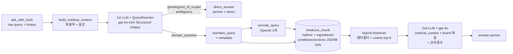

# PLAN — RAG 전면 재설계 (Query Rewriter + Hybrid Metadata Retrieval)

> **Branch base**: `main` (`af11947` 시점)
> **목표**: 사용자 정보 (복용약 + 설문) prepend → 1st LLM 이 단일 호출로
> "재작성 질의 + 메타데이터 + 의도 분류 + 인사/도메인외 즉답 + 대명사 풀이"
> 모두 산출 → metadata 필터 + 임베딩 hybrid retrieval → 2nd LLM 답변.

---

## 0. 사용자 정의 흐름

```
원본 질의: "나 간이 좀 안 좋은데 타이레놀 먹어도 돼?"
+ medical_context (복용약: 타이레놀/메트포민/와파린/오메가3,
                   기저질환: 당뇨/고혈압/심장/신장,
                   알레르기: 항생제/소염제,
                   비흡연/비음주)
        ↓
[1st LLM — gpt-4o-mini, Structured Output]
  의도 분류 + (재작성 질의 + 명시 메타데이터) | 즉답
        ↓
재작성: "간 질환 환자의 타이레놀(아세트아미노펜) 복용 시 주의사항 및 부작용"
metadata: {
  target_ingredients: ["아세트아미노펜"],
  target_conditions: ["liver_disease"],
  target_sections: ["adverse_reaction", "special_event"],
  interaction_concerns: ["메트포르민염산염", "와파린나트륨"]
}
        ↓
[Retriever — Hybrid: metadata 필터 + 임베딩 cosine top-K]
  WHERE ingredients ?| ['아세트아미노펜']
    AND (target_conditions ?| ['liver_disease'] OR target_conditions = '[]')
    AND section = ANY('{adverse_reaction, special_event}')
  ORDER BY embedding <=> $emb LIMIT 15
        ↓
[2nd LLM — gpt-4o]
  답변 (사용자 brand 그대로 사용 + 검색 결과의 성분 정보 반영)
```

---

## 1. 현재 자산 점검 매트릭스

### 살릴 것
| 자산 | 사유 |
|---|---|
| `medicine_chunk.embedding halfvec(3072)` (PR #122) | 저장 효율 ↑, 4000d 한계 안. 본 재설계도 사용 |
| `text-embedding-3-large` | 동일 사용 |
| `OpenAI Structured Outputs` 패턴 | Pydantic schema 강제 — Query Rewriter 도 동일 패턴 |
| `medical_context.py` (복용약 + 설문 빌드) | 그대로. Query Rewriter 의 system 입력 |
| `app/services/rag/openai_embedding.py` | 단건 query 임베딩 1회만 (batch 폐기) |
| `2nd LLM (gpt-4o) generate_chat_response_job` | 그대로. system_prompt 재작성 |
| `aerich 마이그 chain (1~29번)` | 그대로 |
| `진단 로그 4지점 (PR #124)` | 검증 후 별 PR 로 제거 |

### 폐기
| 자산 | 사유 |
|---|---|
| `IntentClassifier` (이름) → `QueryRewriter` 로 통합·개명 | 책임 흡수 |
| `fanout_queries` (cap=10) | 메타필터로 정밀 검색 → 1회 query |
| `fanout_to_tool_calls` | tool_calls 분산 자체 제거 |
| `RRF intra-query` (`rrf.py`) | 단일 query 검색이라 RRF 의미 X |
| `search_medicine_knowledge_base` tool | retriever 직접 호출, RQ tool 분기 제거 |
| `run_tool_calls_job` 의 batch 임베딩 + dispatch | 단건만 처리 — 단순화 또는 폐기 |
| `interaction_tags JSONB` (사용 안 됨) | 새 메타 컬럼 (ingredients/conditions/lifestyle) 으로 대체 |
| `medicine_chunk_embedding_hnsw_idx` (현재 33K, halfvec) | metadata 필터 후 cosine 이라 top-K 가 작음. **유지** 권장 (메타필터로 좁혀진 후보 안에서 cosine 정렬에 도움). 단, retrieval SQL 재설계 |
| `feat/ingredient-grounded-rag` PR (미머지) | 본 재설계에 흡수 — close |

### 재설계
| 항목 | 변경 |
|---|---|
| `medicine_chunk` schema | `ingredients JSONB` + `target_conditions JSONB` + `target_lifestyle JSONB` 컬럼 + GIN 인덱스 추가. content 헤더 `[성분: ...]` 추가 |
| `IntentClassification` schema | `QueryRewriterOutput` 으로 교체 — `rewritten_query`, `metadata` (ingredients/conditions/sections/interactions), intent, direct_answer, referent_resolution |
| `HybridRetriever` | metadata 필터 (JSONB `?|` operator) + cosine ORDER BY hybrid SQL. tsvector BM25 는 옵션으로 보류 |
| `ask_with_tools` 흐름 | tool_calls 분기 제거 → Query Rewriter → Retriever 직접 호출 → 2nd LLM. 단순 3단계 |
| `chunk content + metadata 채움 스크립트` | `scripts/embed_medicine_chunks.py` 가 medicine_ingredient 조회 + 새 메타 컬럼 채움 + 헤더 추가 + 재임베딩 |

---

## 2. 데이터 모델

### 2.1 medicine_chunk 메타 컬럼 추가 (마이그 30번)

```sql
ALTER TABLE medicine_chunk
  ADD COLUMN ingredients JSONB DEFAULT '[]'::jsonb,
  ADD COLUMN target_conditions JSONB DEFAULT '[]'::jsonb,
  ADD COLUMN target_lifestyle JSONB DEFAULT '[]'::jsonb;

CREATE INDEX idx_medicine_chunk_ingredients_gin
  ON medicine_chunk USING gin (ingredients jsonb_path_ops);
CREATE INDEX idx_medicine_chunk_target_conditions_gin
  ON medicine_chunk USING gin (target_conditions jsonb_path_ops);
CREATE INDEX idx_medicine_chunk_target_lifestyle_gin
  ON medicine_chunk USING gin (target_lifestyle jsonb_path_ops);

-- 기존 interaction_tags 컬럼은 유지 (drop 은 별 PR — 의존성 검증 후)
COMMENT ON COLUMN medicine_chunk.ingredients IS 'mtral_name array (medicine_ingredient join 으로 채움)';
COMMENT ON COLUMN medicine_chunk.target_conditions IS 'liver_disease, kidney_disease 등 controlled vocab';
COMMENT ON COLUMN medicine_chunk.target_lifestyle IS 'alcohol, pregnancy, breastfeeding 등';
```

시나리오 A 정책: dummy 모델 변경 → aerich migrate → SQL 덮어씀 → revert (또는 28→29 와 동일하게 28번 binary cp + 본문 변경, MODELS_STATE 그대로 보존).

### 2.2 condition / lifestyle controlled vocabulary

식약처 데이터의 자유 텍스트 (precautions/special_event content) 에서 LLM/규칙으로 추출. 초기 vocabulary:

```
target_conditions:
  liver_disease, kidney_disease, heart_disease, diabetes, hypertension,
  asthma, allergy_penicillin, allergy_nsaid, pregnancy, breastfeeding,
  pediatric, elderly

target_lifestyle:
  alcohol, smoking, driving, fasting, post_meal
```

단, 초기에는 **medicine_ingredient join 으로 ingredients 만 채움** (자동, 정확). conditions/lifestyle 은 별 PR 로 LLM 추출 (정확도 검증 단계 거침).

---

## 3. 1st LLM — QueryRewriter Pydantic schema

```python
class QueryMetadata(BaseModel):
    target_drugs: list[str] = Field(default_factory=list)         # brand 그대로
    target_ingredients: list[str] = Field(default_factory=list)   # 활성성분
    target_conditions: list[str] = Field(default_factory=list)    # liver_disease 등 controlled
    target_sections: list[str] = Field(default_factory=list)      # MedicineChunkSection
    interaction_concerns: list[str] = Field(default_factory=list) # 사용자 복용약의 ingredients

class QueryRewriterOutput(BaseModel):
    intent: IntentType                            # greeting / out_of_scope / domain_question / ambiguous
    direct_answer: str | None = None              # greeting/out_of_scope/ambiguous 일 때만
    rewritten_query: str | None = None            # domain_question 일 때만
    metadata: QueryMetadata | None = None         # domain_question 일 때만
    referent_resolution: dict[str, str] | None = None
```

### system prompt (요지)

```
당신은 'Dayak' 약사 챗봇의 Query Rewriter 입니다.
사용자의 raw 질의 + history + medical_context 를 보고 다음을 결정합니다:

1. intent 분류 (greeting / out_of_scope / domain_question / ambiguous)
2. greeting/out_of_scope/ambiguous → direct_answer 텍스트만
3. domain_question → 다음을 모두 산출:
   - rewritten_query: medical_context 의 사용자 정보 (복용약 brand+성분,
     기저질환, 알레르기) 를 prepend 하여 self-contained 단일 검색 질의로
     재작성. 약 이름 옆에 (성분) 함께 표기.
     예: "간 질환 환자의 타이레놀(아세트아미노펜) 복용 시 주의사항 및 부작용"
   - metadata.target_drugs: 질의에 등장한 brand 이름
   - metadata.target_ingredients: target_drugs 의 활성성분 + medical_context
     의 복용약 ingredient (interaction_concerns 와 별개로 검색 대상 자체)
   - metadata.target_conditions: medical_context + raw query 의 환자상태 표현
     ("간이 안 좋은데" → ['liver_disease']) — controlled vocab 만
   - metadata.target_sections: 의도에 맞는 chunk section list
     (예: 부작용 질문 → ['adverse_reaction', 'precautions'])
   - metadata.interaction_concerns: medical_context 의 복용약 ingredient list
     (상호작용 검사 대상)
4. 대명사 풀이 (referent_resolution) — history 명시 referent 만
```

---

## 4. Retriever — Hybrid SQL

```sql
SELECT mc.id, mc.section, mc.content,
       mi.medicine_name,
       (mc.embedding <=> $1::halfvec(3072)) AS distance
FROM medicine_chunk mc
JOIN medicine_info mi ON mi.id = mc.medicine_info_id
WHERE
  -- (1) ingredient 메타필터 (질의 약 또는 복용약 성분)
  mc.ingredients ?| $2::text[]   -- target_ingredients ∪ interaction_concerns
  -- (2) section 필터 (있으면)
  AND ($3::text[] IS NULL OR mc.section = ANY($3))
  -- (3) condition 필터 — chunk 의 target_conditions 가 비어있거나 (일반 정보)
  --     또는 사용자 condition 과 교집합
  AND (mc.target_conditions = '[]'::jsonb OR mc.target_conditions ?| $4::text[])
ORDER BY distance ASC
LIMIT $5;
```

- 메타필터로 30만 chunks → 수백~수천 후보로 좁힘
- HNSW 인덱스가 cosine 정렬 가속 (메타필터 후 candidate set 안에서)
- 단일 query 1회 호출

### 환자상태 / 섹션 메타가 빈 케이스
- `target_ingredients` 없으면 → 사용자에게 약 명시 요청 (intent=ambiguous 로 fallback) 또는 raw query 임베딩만으로 검색 (안전망)
- `target_conditions` 없으면 → 일반 chunk (target_conditions=[]) 만 검색

---

## 5. 새 데이터 흐름 (Mermaid)



---

## 6. 코드 변경 영역

### 신규
- `app/dtos/query_rewriter.py` — `QueryRewriterOutput` + `QueryMetadata`
- `app/services/intent/query_rewriter.py` — 1st LLM 호출 (이전 classifier.py 흡수)
- `app/services/rag/retrievers/hybrid_metadata.py` — 새 SQL 빌더
- `app/db/migrations/models/30_<ts>_chunk_metadata_columns.py` — 메타 컬럼 + GIN
- `scripts/embed_medicine_chunks.py` 갱신 — ingredients 채움 + content 헤더 (`[성분: ...]`) + 재임베딩

### 수정
- `app/services/message_service.py` `ask_with_tools` — tool_calls/fanout 분기 제거. 3단계 직선 호출로 단순화
- `app/services/chat/medical_context.py` — 그대로 (복용약 + 설문)
- `app/services/chat/intent_orchestrator.py` — Query Rewriter 호출 단순화 (단일 호출, 2-tuple 또는 객체 반환)
- `app/services/chat/rag_context_assembler.py` — 단일 retrieval 결과 직접 포맷 (dedup/평탄화 단순화)
- `app/services/intent/classifier.py` — 폐기 (또는 query_rewriter.py 로 이름 변경)

### 폐기
- `app/services/chat/fanout_tool_calls.py`
- `app/services/rag/retrievers/rrf.py`
- `app/services/tools/router.py` (이미 폐기)
- `ai_worker/domains/tool_calling/jobs.py` 의 batch 임베딩 + RAG dispatch — retrieve_medicine_chunks 호출만 남기거나 fastapi 직접 호출로 단순화 (RQ 우회)
- `app/services/chat/ingredient_mapper.py` (PR1 미머지 — Query Rewriter 가 직접 처리)

---

## 7. 단계별 PR 분할 (의존성 순)

### PR-A — 데이터 모델 + 메타 채움 (마이그 30번)
- 마이그 30번 (메타 컬럼 + GIN)
- `scripts/embed_medicine_chunks.py` 갱신 (ingredients 채움 + content `[성분: ...]` 헤더)
- TRUNCATE medicine_chunk + 재임베딩 (운영 SQL)
- 단위 테스트: 새 컬럼 default + GIN 인덱스 존재 검증
- 비용: 33K × $0.000130/1K tokens ≈ $0.7
- 시간: 재임베딩 10~30분

### PR-B — 1st LLM Query Rewriter (코드만)
- `QueryRewriterOutput` Pydantic schema
- `query_rewriter.py` (gpt-4o-mini Structured Output)
- 단위 테스트: schema 검증 + greeting/out_of_scope/domain_question/ambiguous 분기

### PR-C — Hybrid Retriever (코드만, PR-A 의존)
- `hybrid_metadata.py` SQL 빌더
- 단위 테스트: SQL 형태 + params 슬롯 검증
- e2e mock 테스트: rewritten_query + metadata → retrieval 결과

### PR-D — ask_with_tools 단순화 + 폐기 코드 제거
- 3단계 직선 호출
- fanout_to_tool_calls / rrf / search_medicine_knowledge_base tool / batch embed dispatch 제거
- e2e mock 테스트 갱신
- 진단 로그 (PR #124) 정리 — 검증 후 제거

### PR-E (선택, 별 본격) — condition / lifestyle controlled vocab 채움
- LLM 으로 chunk content 분석 → target_conditions/lifestyle 채움
- 정확도 spot-check 후 운영 적용

### PR-F — timeout 60s 복귀 + 최종 정리

---

## 8. Affected Files (PR 별)

PR-A: `app/db/migrations/models/30_<ts>_chunk_metadata_columns.py` (신규), `scripts/embed_medicine_chunks.py`, `app/models/medicine_chunk.py` (메타 컬럼 모델 노출)

PR-B: `app/dtos/query_rewriter.py`, `app/services/intent/query_rewriter.py` (신규), `tests/unit/test_query_rewriter.py`, 폐기: `app/services/intent/classifier.py`, `app/dtos/intent.py` (또는 deprecation)

PR-C: `app/services/rag/retrievers/hybrid_metadata.py` (신규), `tests/unit/test_hybrid_metadata.py`, 폐기: `app/services/rag/retrievers/hybrid.py` `_bm25_search` (옵션)

PR-D: `app/services/message_service.py`, `app/services/chat/intent_orchestrator.py`, `app/services/chat/rag_context_assembler.py`, `app/services/tools/rq_adapters.py`, `ai_worker/domains/tool_calling/jobs.py`, `ai_worker/domains/rag/retrieval.py`, 폐기: `app/services/chat/fanout_tool_calls.py`, `app/services/rag/retrievers/rrf.py`, 진단 로그 위치 4곳

---

## 9. 다운타임 / 비용 / 롤백

| 단계 | 다운타임 | 비용 | 롤백 |
|---|---|---|---|
| PR-A 마이그 ALTER | ~수십초 (default '[]' 추가) | 0 | 마이그 downgrade |
| PR-A 재임베딩 | TRUNCATE + 재 INSERT — 검색 일시 fail (~30분) | $0.7 | 백업 dump 복원 |
| PR-B/C/D 코드만 | 0 | 0 | 코드 revert |
| PR-E 메타 채움 | 0 (UPDATE in batch) | LLM 비용 (검증 후) | 메타 컬럼 reset |

### 사고 회피
- PR-A 의 재임베딩 시 308K 가 아닌 현재 33K 로만 (Pre-scope reduction 상태). 이후 scope 확장 별 PR
- 백업 dump 는 이미 로컬 보유 (`E:\Project\Team_Project\OZ-Final\backups\medicine_chunk_pre_scope_20260503_0001.dump` 4.4GB) — 안전망

---

## 10. 결정 매트릭스 / 트레이드오프

| 결정 | 채택 | 사유 |
|---|---|---|
| 메타 컬럼 vs 별 테이블 | **메타 컬럼 (JSONB)** | join 비용 ↓, GIN 으로 충분히 빠름. 별 테이블은 over-engineering |
| 1st LLM 통합 vs 분리 | **통합** | 사용자 정의대로. 호출 1회로 응답 빠름, 비용 ↓ |
| BM25 (tsvector) | **본 PR 보류** | 메타필터 + cosine 으로 충분. 한국어 BM25 의 toolbox (mecab) 부재. 별 PR |
| RQ tool_calls 우회 | **단순화** | tool_calls 분기 자체 폐기. retriever 직접 호출 (RQ 는 2nd LLM 만 사용) |
| chunk content 헤더 `[성분: ...]` | **추가** | query 측 임베딩과 chunk 측 cosine 매칭 ↑ (메타필터로 좁힌 후 ranking 정확도 ↑) |
| condition / lifestyle 자동 추출 | **별 PR-E** | 정확도 검증 + LLM 비용 별도 |

---

## 11. Plan Review 체크리스트 (CLAUDE.md §11)

- [x] Goal 명확 (사용자 정의 흐름 그대로 구현)
- [x] 트레이드오프 사용자 제시 + 결정 받음
- [x] 외부 best example 검토 — pgvector 0.8 halfvec + JSONB GIN hybrid 패턴 (LangChain RAG, OpenAI Cookbook 2024)
- [x] TDD Steps 비즈니스 단위로 분할 (PR-B/C/D 의 단위 테스트)
- [x] Affected Files 명시
- [x] Mermaid 흐름도 포함

---

## 12. 후속 PR / 미해결

- 사용자 medication 의 OCR 텍스트 → medicine_info_id FK 사후 매칭 (별 service)
- brand alias dictionary (medicine_info 에 없는 brand: "타이레놀" 같은 경우 보강)
- condition / lifestyle controlled vocab 자동 추출 (PR-E)
- chain 정상화 (refactor/migrations-normalize) 보류

---

## 13. Go 진행 순서

1. **PR-A**: 마이그 30번 + scripts 갱신 + 재임베딩
2. **PR-B**: Query Rewriter 1st LLM
3. **PR-C**: Hybrid Retriever
4. **PR-D**: ask_with_tools 단순화 + 폐기 정리 + 진단 로그 제거
5. **PR-E**: condition/lifestyle 자동 추출 (별 사이클)
6. **PR-F**: timeout 60s 복귀
