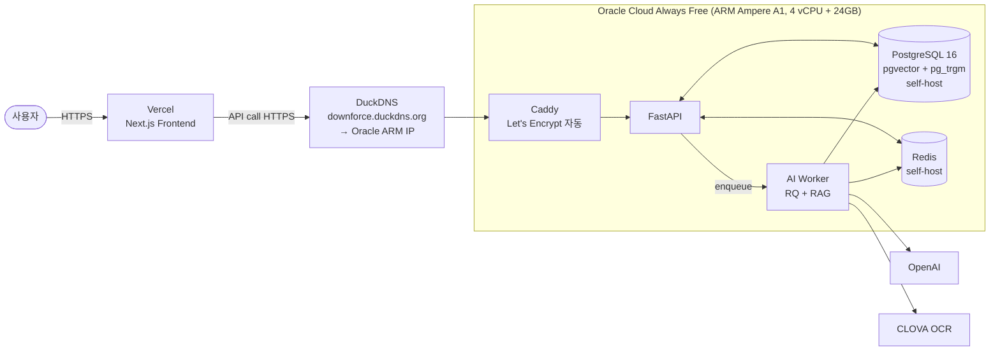

# PLAN — v2.0 무료 스택 재배포

> Base: `main` (`96d3d26` 시점)
> ROADMAP: [v2.0 항목](../../ROADMAP.md#v20--무료-스택-재배포)
> 사용자 승인 후 PR-1부터 시작 ([CLAUDE.md §1.1](../../CLAUDE.md))

---

## 0. Goal

팀 시점 AWS EC2 종료로 라이브 데모 부재 상태. **인프라 비용 0원** 스택으로 라이브 데모를 복원한다.

### Done 조건 (ROADMAP §v2.0 DoD)

- 외부 URL 한 줄로 카카오 로그인 → 처방전 OCR → 챗봇 응답 full flow 동작
- 월 인프라 비용 = 0원 (LLM/OCR API 사용량분만 본인 부담)
- README §1 "서비스 화면" 섹션 갱신 (GIF + 데모 URL)

---

## 1. 핵심 결정 사항

### 1.0 사용자 확정 결정 (2026-05-31)

| 항목     | 결정                                          | PLAN 추천 대비 |
| ------ | ------------------------------------------- | ---------- |
| DB     | **Oracle ARM self-host PostgreSQL** (pgvector pg15) | 추천안 채택     |
| Redis  | **Oracle ARM self-host** (현 `redis:alpine`) | 추천안 채택     |
| 도메인    | **DuckDNS + Caddy (Let's Encrypt)**         | 추천 변경 (PLAN은 Cloudflare Tunnel 추천이었음) |
| ghcr.io | **`kimyeongbin-dev` 본인 user namespace**     | 추천안 채택     |

이하 §1 본문은 결정 근거와 후보 비교 기록.

### TO-1. BE/Worker 호스팅 — **추천: Oracle Cloud Always Free (ARM Ampere A1)**

| 옵션                          | 사양                       | 장점                                            | 단점                                                  |
| --------------------------- | ------------------------ | --------------------------------------------- | --------------------------------------------------- |
| **A. Oracle ARM (추천)**       | 4 vCPU · 24GB RAM        | 진짜 평생 무료. Docker Compose 그대로. EC2 패턴 100% 이식 | ARM 아키텍처 (multi-arch image 확인 필요). region 재고 부족 가능 |
| B. Fly.io Free              | shared CPU · 256MB       | 글로벌 edge                                      | 2024-10부터 free 제한 강화 — 본 프로젝트 메모리(~3GB) 절대 부족      |
| C. Render Free              | 512MB · 1 vCPU           | 배포 UX 간단                                      | 15분 idle 시 sleep → SSE long-poll 부적합                |

→ **A 채택**. 현 `docker-compose.prod.yml`의 메모리 합계가 약 3.4GB(postgres 0.5 + redis 0.25 + fastapi 0.5 + ai-worker 2.0 + nginx 0.13)인데, ARM 24GB는 8배 여유.

### TO-2. DB — **추천 변경 검토: Oracle ARM self-host PostgreSQL**

| 옵션                                | 용량      | 장점                              | 단점                                                  |
| --------------------------------- | ------- | ------------------------------- | --------------------------------------------------- |
| A. Neon                           | 0.5GB   | 서버리스, scale-to-zero. pgvector 지원 | medicine_chunk halfvec 200~400MB + WAL/idx로 마진 빠듯 |
| B. Supabase                       | 0.5GB   | pgvector 공식 지원                  | RLS 미사용, free tier 일부 정책 변동                        |
| **C. Oracle ARM self-host (추천 변경)** | 24GB 안 자유 | 용량 제한 X. pg_trgm/halfvec 자유. 백업도 ARM 안 cron | 운영 부담 (백업/모니터링 본인)                                  |

→ **ROADMAP 가정(Neon)에서 C로 변경 권장**. 사유:
- medicine_chunk 33K × halfvec(3072d, 6KB) ≈ 200MB. HNSW 인덱스 + WAL + 다른 테이블까지 합치면 400MB+. Neon free 0.5GB **마진 매우 빠듯**
- 향후 medicine_chunk 확장 시(33K → 308K, PLAN.md §9 참고) 즉시 한계 초과
- Oracle ARM 24GB 안에서 pgvector pg15 컨테이너로 self-host하면 용량 / extension / 백업 모두 자유

**확인 필요**: 사용자 의견. Neon으로 가도 무방한가? 아니면 Oracle ARM self-host?

### TO-3. Redis/Queue — **추천 변경: Oracle ARM self-host Redis**

| 옵션                      | free 한도            | 결론                                                                   |
| ----------------------- | ------------------ | -------------------------------------------------------------------- |
| A. Upstash Redis        | 10K command/day    | **부족**. RQ는 dequeue polling 기반 — idle도 분당 60+ BRPOP → 일 86,400 cmd 초과 |
| **B. Oracle ARM self-host (추천)** | 무제한 (메모리 한도 내)     | 현 `redis:alpine` 컨테이너 그대로                                            |

→ **ROADMAP의 Upstash 가정 폐기, B로 변경**. ROADMAP.md v2.0 섹션도 업데이트 필요 (PR-6에서 함께).

### TO-4. FE 호스팅 — **추천: Vercel Hobby**

| 옵션              | 장점                                  | 단점                          |
| --------------- | ----------------------------------- | --------------------------- |
| **A. Vercel (추천)** | Next.js first-class. CDN/이미지 자동. 100GB/월 대역폭 | cross-origin (API 측 CORS 설정 필요) |
| B. Oracle ARM self-host | same-origin. 단순                    | CDN 없음. ARM 부하 ↑            |

→ **A 채택**. CORS는 FastAPI 측 미들웨어로 처리.

### TO-5. 도메인 + HTTPS — **확정: DuckDNS + Caddy (Let's Encrypt)**

| 옵션                                    | 장점                                     | 단점                              |
| ------------------------------------- | -------------------------------------- | ------------------------------- |
| A. Cloudflare Tunnel + 본인 도메인         | HTTPS 자동. NAT 우회. DDoS 보호. ARM에 80/443 노출 불필요 | 본인 도메인 필요 (.dev 약 $12/년 등)       |
| **B. DuckDNS + Caddy (Let's Encrypt) (확정)** | 완전 무료. 팀 시점 패턴(`ai-02-06.duckdns.org`)과 유사. Caddy가 인증서 자동 갱신 | ARM에 80/443 직접 노출 → ufw/fail2ban 등 일반 보안 점검 필요 |
| C. Cloudflare Tunnel + free trycloudflare.com | 도메인 0원                                | URL 임시. 포트폴리오로 부적합              |

→ **B 확정**. DuckDNS 신규 hostname (예: `downforce.duckdns.org`) 신청 + Oracle ARM의 reserve public IP에 매핑. Caddy가 Let's Encrypt 인증서 발급/갱신 자동.

---

## 2. 배포 후 시스템 아키텍처 (Mermaid)

핵심: 모든 서버측 컴포넌트가 **단일 ARM 인스턴스 안**. Vercel은 FE만. 외부 HTTPS 진입은 DuckDNS 도메인 + Caddy (Let's Encrypt 자동 갱신).

---

## 3. PR 분할 (의존성 순)

큰 작업 6단계. 각 PR은 독립 머지 가능하도록 분할.

### PR-1 — 환경 분리 + secrets 정비 (코드만, 인프라 X)

**파일 변경**:
- `envs/example.prod.env`: Oracle ARM + Vercel 가정 + Cloudflare 환경변수 추가 + EC2 가정 코멘트 제거
- `docker-compose.prod.yml`: ARM 호환성 — `pgvector/pgvector:pg15`가 multi-arch (linux/arm64) 확인 + 필요 시 `pg17` 또는 빌드. 리소스 limit은 ARM 24GB 기준 재산정
- `.github/workflows/deploy.yml`:
  - ghcr.io org: `ai-healthcare-02` → `kimyeongbin-dev` (또는 본인 사용자명)
  - EC2 가정 변수명만 일단 ORACLE_*로 변경 (실 SSH는 PR-3)

**검증**: `docker compose -f docker-compose.prod.yml config` 통과 + `gh workflow view deploy.yml`에서 secret 참조 깨짐 없음

### PR-2 — Oracle ARM 인스턴스 + DB/Redis self-host 검증 (인프라)

**작업**:
- Oracle Cloud Always Free 계정 셋업 (Ampere A1, 4 vCPU + 24GB, Ubuntu 22.04 ARM)
- 보안 그룹: ingress 22 (SSH), 80/443 (Cloudflare Tunnel 쓰면 불필요)
- Docker + Docker Compose 설치
- `docker-compose.prod.yml` 띄우기 (postgres + redis만 우선)
- aerich 마이그 1회 적용
- drug data seed 축소판 (1000건 → 1만건 → 33K 단계적)

**검증**:
- SSH 접속 가능
- `docker ps` → postgres/redis healthy
- `aerich upgrade` exit 0
- `SELECT COUNT(*) FROM medicine_chunk` 정상

### PR-3 — deploy.yml 실 배포 + 첫 ARM 배포 (자동화)

**파일 변경**:
- `.github/workflows/deploy.yml`: secrets 교체 (`EC2_HOST` → `ORACLE_HOST` 등)
- GitHub Secrets에 새 값 등록
- ghcr.io org 이전에 따른 image path 갱신

**검증**:
- `main` push → CI green → ARM에 deploy 성공
- `curl http://<oracle-ip>:8000/api/v1/health` → 200

### PR-4 — FE Vercel 배포 + CORS

**파일 변경**:
- `medication-frontend/.env.production` (또는 Vercel Dashboard env): `NEXT_PUBLIC_API_URL=<API 도메인>`
- `app/main.py`: CORS 미들웨어에 Vercel 도메인 추가
- `app/core/config.py`: `ALLOWED_ORIGINS` env 화

**검증**:
- Vercel preview URL 접속 → 로그인 화면 도착
- 브라우저 dev tools → API 호출 CORS 없이 성공

### PR-5 — 도메인 + HTTPS + SSE long-poll 검증

**작업**:
- DuckDNS 신규 hostname 신청 (`downforce.duckdns.org`)
- Oracle ARM에 Reserve Public IP 할당 + DuckDNS A 레코드 매핑
- Caddy 컨테이너 셋업 (Let's Encrypt 자동 발급/갱신)
- ARM 보안: ufw로 22/80/443만 허용 + fail2ban (선택)
- SSE long-poll 패스스루 검증 (Caddy `flush_interval` 등 조정)

**파일 변경**:
- `Caddyfile` (신규) — 기존 `nginx/prod_https.conf`는 보존하되 docker-compose에서 비활성화 또는 교체
- `docker-compose.prod.yml` — nginx 서비스 → caddy로 교체 (또는 둘 다 두고 profile로 분기)

**검증**:
- `https://downforce.duckdns.org/api/v1/health` → 200 + Let's Encrypt 인증서 유효
- 외부 URL로 카카오 로그인 → /survey → 처방전 OCR → 챗봇 SSE stream 동작

### PR-6 — README §1 갱신 + ROADMAP 수정 + v2.0.0 Release

**파일 변경**:
- `README.md` §1 "서비스 화면": GIF (chrome-extension Loom 또는 ScreenToGif) + 데모 URL
- `ROADMAP.md` v2.0 섹션: Upstash 가정 → self-host Redis로 수정. v2.0 상태를 "완료"로
- `docs/plans/v2_0_redeployment.md`: 종료 회고 섹션 추가 + checkboxes 전부 체크

**작업**:
- `v2.0.0` annotated tag + GitHub Release 등록

---

## 4. Affected Files (전체 PR 통합)

| 영역 | 파일 |
|---|---|
| 환경 변수 | `envs/example.prod.env`, `medication-frontend/.env.production` (신규) |
| Compose | `docker-compose.prod.yml` (ARM 리소스 + multi-arch 확인) |
| CI/CD | `.github/workflows/deploy.yml` (secrets + ghcr.io org + SSH target) |
| 앱 코드 | `app/main.py` (CORS), `app/core/config.py` (ALLOWED_ORIGINS env) |
| 프록시 | `nginx/prod_https.conf` (또는 `Caddyfile` 신규) |
| 문서 | `README.md` §1, `ROADMAP.md` v2.0, `docs/plans/v2_0_redeployment.md` |

---

## 5. 외부 best example / 사전 조사 (CLAUDE.md §10 Research Checklist)

PR-2 시작 전 다음을 공식 docs로 확인. 각 항목 끝에 **출처 + 연도** 명시 의무.

- [ ] Oracle Cloud Always Free + ARM Ampere A1 한도 (2025-Q4 또는 2026 최신) + Reserve Public IP 무료 정책
- [ ] `pgvector/pgvector:pg15` multi-arch (linux/arm64) 지원 여부
- [ ] DuckDNS 갱신 정책 + 정적 IP 매핑 베스트 (cron 갱신 필요 여부)
- [ ] Caddy 2.x SSE 패스스루 베스트 (`flush_interval`, `transport http` 옵션)
- [ ] Caddy + Let's Encrypt 인증서 자동 갱신 (Docker 컨테이너 패턴)
- [ ] Vercel Hobby Next.js 15 App Router + Server Actions 호환 (2025-2026)
- [ ] Vercel ↔ 외부 API CORS 권장 패턴
- [ ] CLOVA OCR / OpenAI API의 ARM 클라이언트 호환성 (Python lib이라 사실상 무관일 가능성 높음)

---

## 6. 검증 시나리오 (TDD 대체)

v2.0은 인프라 작업이라 단위 테스트 직접 적용 어려움. 다음 8개 시나리오로 대체 검증.

1. SSH로 Oracle ARM 접속 가능
2. `docker compose -f docker-compose.prod.yml ps` → fastapi + ai-worker + postgres + redis + nginx/caddy 모두 running + healthy
3. `curl https://<api-domain>/api/v1/health` → 200 OK
4. 카카오 OAuth 콜백 → 신규 user `/survey`, 기존 user `/main` 분기 정상
5. 처방전 이미지 업로드 → OCR 결과 응답 (CLOVA OCR healthcheck)
6. 챗봇 질의 → SSE stream 응답 수신 (OpenAI healthcheck)
7. 가족 프로필 전환 → context 격리 확인 (PR #138/#140 fix 회귀 없음)
8. `df -h /` → ARM 디스크 사용량 50% 미만 유지

---

## 7. 리스크 / 미해결

| 리스크 | 영향 | 완화책 |
|---|---|---|
| ARM image 호환성 (`pgvector/pgvector:pg15`가 amd64 only일 경우) | PR-2 차단 | (1) PG 17 multi-arch로 갱신 (2) ARM에서 직접 빌드 (3) Supabase로 폴백 |
| ai-worker가 PyTorch CPU/sentence-transformers 의존 — ARM wheel 부재 시 빌드 30+분 | PR-3 첫 배포 느림 | Dockerfile에서 사전 wheel 다운로드 + ghcr cache 활용 |
| Caddy SSE 패스스루 기본 설정 미세 조정 (long-poll buffering) | 챗봇 응답 지연 | `flush_interval -1` 또는 `transport http { versions 1.1 }` 명시 |
| DuckDNS 무료 hostname → 60일 무활동 시 만료 | 도메인 만료 | DuckDNS update 토큰으로 cron 5분 주기 갱신 (Oracle ARM 안 cron) |
| Oracle Reserve Public IP 미할당 시 인스턴스 재시작마다 IP 변경 | DNS 갱신 부담 | 인스턴스 생성 직후 Reserve Public IP 할당 (무료 1개) |
| Oracle Always Free region 재고 부족 | PR-2 시작 불가 | 다른 region 시도 (ap-tokyo-1 / ap-osaka-1 / ap-singapore-1) |
| ghcr.io 이미지 org 이전 — 기존 `ai-healthcare-02` org는 본인이 admin 아닐 수 있음 | PR-1 차단 | 본인 user namespace(`kimyeongbin-dev`)로 push, deploy.yml의 image path만 갱신 |
| ARM에 80/443 직접 노출 (Cloudflare 미사용) | 일반 web 공격 노출 | ufw로 inbound 22/80/443만 허용 + Caddy 자동 HTTPS 강제 + fail2ban (선택) |

---

## 8. 비용 예상

| 항목 | 월 비용 |
|---|---|
| Oracle ARM (Always Free) | 0원 |
| Self-host PostgreSQL/Redis (Oracle ARM 안) | 0원 |
| Vercel Hobby | 0원 |
| Cloudflare Tunnel | 0원 (본인 도메인 별도 — `.dev` 약 $12/년 등) |
| OpenAI API | 사용량분 (포트폴리오 데모 트래픽 가정 월 < $5) |
| CLOVA OCR | 사용량분 (월 < $5) |
| **합계** | **<$10/월** (LLM/OCR 본인 부담분만) |

---

## 9. Plan Review 체크리스트 (CLAUDE.md §11)

- [x] Goal 명확 (라이브 URL + 0원 인프라)
- [x] 트레이드오프 5종 (TO-1 ~ TO-5) 사용자 제시
- [x] 외부 조사 영역 명시 (§5 — PR-2 시작 전 완료)
- [x] 작업 단위 분할 (PR-1 ~ PR-6, 각자 독립 머지 가능)
- [x] Affected Files 명시 (§4)
- [x] Mermaid 흐름도 (§2)
- [x] 리스크 + 완화책 (§7)
- [x] 검증 시나리오 (§6 — TDD 대체)
- [x] 비용 산정 (§8)

---

## 10. 사용자 확인 사항 요약

PLAN 승인 시 결정 (모두 §1.0에 확정 기록):

1. ~~TO-2 DB~~ → Oracle ARM self-host PostgreSQL (확정)
2. ~~TO-3 Redis~~ → Oracle ARM self-host (확정)
3. ~~TO-5 도메인~~ → DuckDNS + Caddy + Let's Encrypt (확정)
4. ~~ghcr.io org~~ → `kimyeongbin-dev` 본인 user namespace (확정)
5. **PR 순서 + 'go' 승인** — 본 PLAN의 PR-1 ~ PR-6 순서대로 진행해도 되는지 사용자 최종 확인

---

## 11. Go 진행 순서

사용자 `go` 승인 후:
1. **PR-1** — 환경 분리 + secrets 정비 (당일 가능)
2. **PR-2** — Oracle ARM 인스턴스 + DB/Redis self-host 검증 (하루)
3. **PR-3** — deploy.yml 실 배포 (PR-2 완료 후 당일)
4. **PR-4** — FE Vercel 배포 + CORS (당일)
5. **PR-5** — 도메인 + HTTPS + SSE 검증 (하루)
6. **PR-6** — README §1 갱신 + v2.0.0 Release (당일)

전체 예상: **3~5일** (Oracle 계정 승인 대기 시간 포함)
